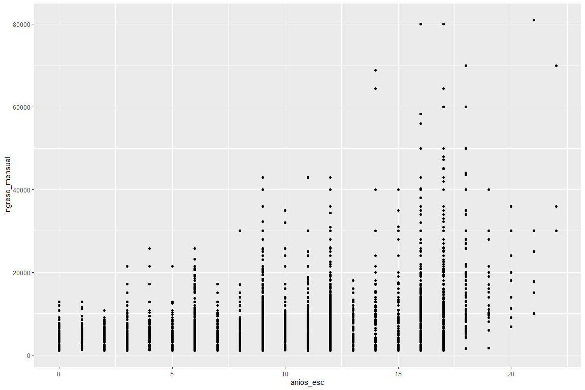
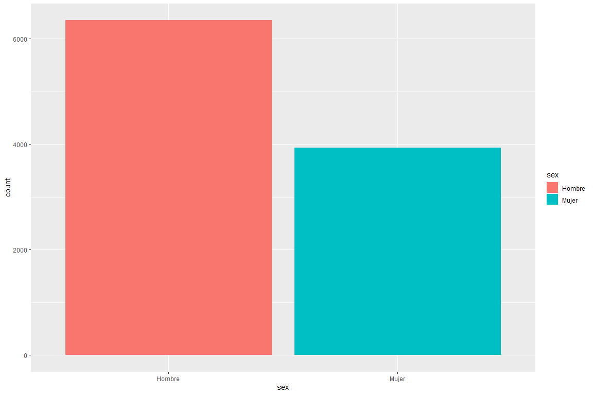
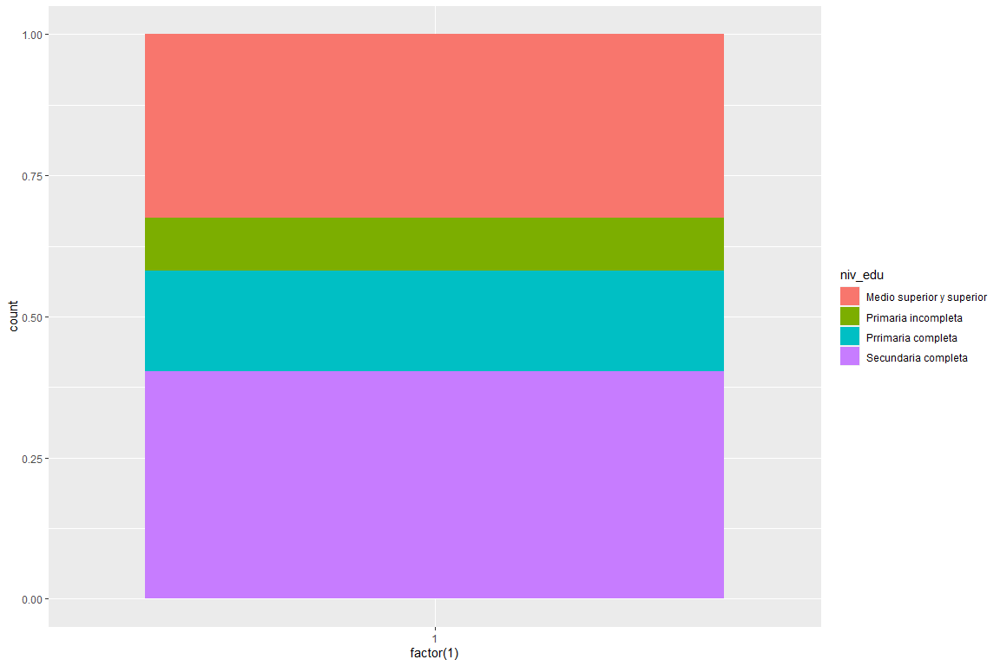

ggplot2
================

``` r
knitr::opts_chunk$set(fig.width=12, fig.height=8)
```

``` r
setwd("C:/Users/david/OneDrive/Escritorio/Personal/a2/Curso - R/R/R")
```

``` r
library(readxl)

enoe <- read_excel("C:/Users/david/OneDrive/Escritorio/Personal/a2/Curso - R/3. GGPlot2/mu_enoe.xlsx")

enoe
```

    ## # A tibble: 10,280 × 12
    ##    estado     sex     edad asiste pos_ocu ing_salarios niv_edu anios_esc hrsocup
    ##    <chr>      <chr>  <dbl> <chr>  <chr>   <chr>        <chr>       <dbl>   <dbl>
    ##  1 Hidalgo    Mujer     56 No     Trabaj… Más de 1 ha… Secund…        12      45
    ##  2 Durango    Hombre    52 No     Trabaj… Más de 3 ha… Medio …        17      66
    ##  3 Jalisco    Hombre    25 No     Trabaj… Más de 3 ha… Medio …        15      48
    ##  4 Tabasco    Mujer     50 No     Trabaj… Más de 1 ha… Secund…         9      46
    ##  5 Tabasco    Mujer     41 No     Trabaj… Hasta un sa… Medio …        17       5
    ##  6 Nuevo León Mujer     36 No     Trabaj… Más de 1 ha… Secund…         9      50
    ##  7 Zacatecas  Mujer     23 Si     Trabaj… Más de 1 ha… Medio …        16      48
    ##  8 Colima     Hombre    59 No     Trabaj… Más de 1 ha… Primar…         4      28
    ##  9 Sinaloa    Hombre    37 No     Trabaj… Más de 1 ha… Secund…         9      48
    ## 10 Sinaloa    Hombre    18 No     Trabaj… Más de 1 ha… Prrima…         8      48
    ## # ℹ 10,270 more rows
    ## # ℹ 3 more variables: ingreso_mensual <dbl>, num_trabajos <chr>,
    ## #   tipo_empleo <chr>

``` r
class(enoe)
```

    ## [1] "tbl_df"     "tbl"        "data.frame"

``` r
dim(enoe)
```

    ## [1] 10280    12

``` r
colnames(enoe)
```

    ##  [1] "estado"          "sex"             "edad"            "asiste"         
    ##  [5] "pos_ocu"         "ing_salarios"    "niv_edu"         "anios_esc"      
    ##  [9] "hrsocup"         "ingreso_mensual" "num_trabajos"    "tipo_empleo"

``` r
library(ggplot2)

ggplot(data = enoe)+
  geom_point(mapping=aes(x=anios_esc, y=ingreso_mensual))
```

<!-- -->

``` r
ggplot(data = enoe)+
  geom_point(mapping=aes(x=anios_esc, y=ingreso_mensual), color = "orange")
```

<!-- -->

``` r
ggplot(data = enoe)+
  geom_point(mapping = aes(x=anios_esc, y = ingreso_mensual, color = tipo_empleo))
```

<!-- -->

``` r
ggplot(data = enoe)+
  geom_point(mapping = aes(x=anios_esc, y = ingreso_mensual, shape = tipo_empleo))
```

<!-- -->

``` r
ggplot(data = enoe)+
  geom_point(mapping = aes(x = anios_esc, y = edad, alpha = ingreso_mensual))
```

<!-- -->

“alpha” da un gradiente a los puntos de acuerdo a una variable

``` r
ggplot(data = enoe)+
  geom_point(aes(anios_esc, ingreso_mensual), color = "orange")+
  geom_smooth(aes(anios_esc, ingreso_mensual), color = "orange")
```

    ## `geom_smooth()` using method = 'gam' and formula = 'y ~ s(x, bs = "cs")'

<!-- --> “smooth” es
una línea suavizada

``` r
ggplot(data = enoe)+
  geom_point(aes(anios_esc, ingreso_mensual))+
  facet_wrap(~sex, nrow=1,ncol=2)
```

<!-- -->

``` r
ggplot(data = enoe)+
  geom_point(aes(anios_esc, ingreso_mensual, color = tipo_empleo))+
  facet_wrap(~sex, nrow=1,ncol=2)
```

<!-- -->

``` r
ggplot(data = enoe)+
  geom_point(aes(anios_esc, ingreso_mensual))+
  facet_grid(tipo_empleo~sex)
```

<!-- -->
“facet_grid” se usa para variables categóricas

``` r
ggplot(data = enoe)+
  geom_smooth(aes(x=anios_esc, y = ingreso_mensual))
```

    ## `geom_smooth()` using method = 'gam' and formula = 'y ~ s(x, bs = "cs")'

<!-- --> En R los
diferentes tipos de gráficas son diferentes “geometrias”

``` r
ggplot(data = enoe)+
  geom_smooth(aes(x=anios_esc, y = ingreso_mensual, linetype = sex))
```

    ## `geom_smooth()` using method = 'gam' and formula = 'y ~ s(x, bs = "cs")'

<!-- -->

``` r
ggplot(data = enoe)+
  geom_smooth(mapping = aes(x = anios_esc, y=ingreso_mensual, linetype = tipo_empleo))
```

    ## `geom_smooth()` using method = 'gam' and formula = 'y ~ s(x, bs = "cs")'

<!-- -->

``` r
ggplot(data = enoe)+
  geom_smooth(mapping = aes(x = anios_esc, y=ingreso_mensual, linetype = tipo_empleo))+
  geom_point(mapping=aes(x=anios_esc, y=ingreso_mensual, color = tipo_empleo))
```

    ## `geom_smooth()` using method = 'gam' and formula = 'y ~ s(x, bs = "cs")'

<!-- --> Ambas
gráficas tienen los mismos aes, se puede decir desde el principio

``` r
ggplot(data = enoe, mapping=aes(x = anios_esc, y=ingreso_mensual))+
  geom_point(mapping = aes(color =tipo_empleo))+
  geom_smooth(mapping = aes(linetype=tipo_empleo))
```

    ## `geom_smooth()` using method = 'gam' and formula = 'y ~ s(x, bs = "cs")'

<!-- --> Se pueden
especificar los aes desde ggplot

``` r
ggplot(data = enoe, mapping = aes(x = anios_esc, y = ingreso_mensual))+
  geom_point(mapping = aes(color = niv_edu), show.legend = F)
```

<!-- -->

### TRANSFORMACIONES ESTADÍSTICAS

``` r
ggplot(data = enoe)+
  geom_bar(mapping = aes(x = sex))
```

<!-- -->

``` r
ggplot(data = enoe)+
  stat_count(mapping=aes(x=sex))
```

<!-- -->
“stat_count” permite sacar estadística en las gráficas

``` r
ggplot(data = enoe)+
  stat_count(mapping=aes(x=sex, y =..prop..,group=1))
```

    ## Warning: The dot-dot notation (`..prop..`) was deprecated in ggplot2 3.4.0.
    ## ℹ Please use `after_stat(prop)` instead.

<!-- -->
“..prop..,group=” permite ver la gráfica en forma de %

``` r
?geom_bar
```

    ## starting httpd help server ... done

“?” antes de una función permite ver para qué funciona

``` r
ggplot(data = enoe)+
  stat_summary(
    mapping=aes(x=sex, y=ingreso_mensual),
    fun.min = min,
    fun.max=max,
    fun=median
  )
```

<!-- --> “fun.min,
fun.max, fun” permite aplicar análisis estadístico en la misma gráfica

“stat_summary” es como una gráfica de cajas y bigotes en R

### AJUSTES DE POSICIÓN

``` r
ggplot(data = enoe)+
  geom_bar(mapping = aes(x=sex, fill = sex))
```

<!-- -->

``` r
ggplot(data = enoe)+
  geom_bar(mapping = aes(x=sex, fill = niv_edu))
```

<!-- --> “fill”
requiere de variables categoricas

``` r
ggplot(data = enoe, mapping=aes(x=sex, fill=niv_edu))+
  geom_bar(alpha=1/5, position="identity")
```

<!-- -->

``` r
ggplot(data = enoe, mapping=aes(x=sex, fill=niv_edu))+
  geom_bar(position="identity")
```

<!-- --> position =
“identity” genera un apilamiento en una misma posición en 3D, por lo que
hay que usar transparencia para verlo.

``` r
ggplot(data = enoe, mapping=aes(x=sex, color=niv_edu))+
  geom_bar(fill = NA, position="identity")
```

<!-- -->

``` r
ggplot(data = enoe, mapping=aes(x=sex, fill = niv_edu))+
  geom_bar(position = "fill")
```

<!-- --> position =
“fill” me da un gráfico en forma de proporciones

``` r
ggplot(data = enoe, mapping=aes(x=factor(1), fill = niv_edu))+
  geom_bar(position = "fill")
```

<!-- -->

``` r
ggplot(data = enoe, mapping = aes(x=sex, fill = niv_edu))+
  geom_bar(position = "dodge")+
  labs(title = "a", x = "sexo", y = "observaciones")
```

<!-- --> “dodge”
permite ver los datos en barras independientes

``` r
ggplot(data = enoe)+
  geom_point(mapping=aes(x=anios_esc, y=ingreso_mensual), position = "jitter")
```

<!-- --> “jitter”
mueve los puntos para ver todos así estén en el mismo lugar

### SISTEMA DE COORDENADAS

``` r
ggplot(data = enoe, mapping = aes(x = niv_edu, y=ingreso_mensual))+
  geom_boxplot()
```

<!-- -->

``` r
ggplot(data = enoe, mapping = aes(x = niv_edu, y=ingreso_mensual))+
  geom_boxplot()+
  coord_flip()
```

<!-- -->
“coord_flip” rota las gráficas

``` r
barra <- ggplot(data = enoe)+
  geom_bar(mapping=aes(x=niv_edu, fill=niv_edu),
           show.legend = F, with = 1)+
  theme(aspect.ratio = 1)+
  labs(x = NULL, y = NULL)
```

    ## Warning in geom_bar(mapping = aes(x = niv_edu, fill = niv_edu), show.legend =
    ## F, : Ignoring unknown parameters: `with`

``` r
barra
```

<!-- -->

``` r
barra + coord_flip()
```

<!-- -->

``` r
barra + coord_polar()
```

<!-- -->

``` r
ggplot(data = enoe, mapping = aes(x=factor(1), fill = niv_edu))+
  geom_bar(position = "fill")+
  coord_polar(theta = "y")
```

<!-- -->
