Exploración de datos
================

``` r
knitr::opts_chunk$set(fig.width=12, fig.height=8)
```

``` r
library(tidyverse)
```

    ## Warning: package 'tidyverse' was built under R version 4.2.3

    ## Warning: package 'ggplot2' was built under R version 4.2.3

    ## Warning: package 'tibble' was built under R version 4.2.3

    ## Warning: package 'tidyr' was built under R version 4.2.3

    ## Warning: package 'readr' was built under R version 4.2.3

    ## Warning: package 'purrr' was built under R version 4.2.3

    ## Warning: package 'dplyr' was built under R version 4.2.3

    ## Warning: package 'stringr' was built under R version 4.2.3

    ## Warning: package 'forcats' was built under R version 4.2.3

    ## Warning: package 'lubridate' was built under R version 4.2.3

    ## ── Attaching core tidyverse packages ──────────────────────── tidyverse 2.0.0 ──
    ## ✔ dplyr     1.1.4     ✔ readr     2.1.5
    ## ✔ forcats   1.0.0     ✔ stringr   1.5.1
    ## ✔ ggplot2   3.5.0     ✔ tibble    3.2.1
    ## ✔ lubridate 1.9.3     ✔ tidyr     1.3.1
    ## ✔ purrr     1.0.2     
    ## ── Conflicts ────────────────────────────────────────── tidyverse_conflicts() ──
    ## ✖ dplyr::filter() masks stats::filter()
    ## ✖ dplyr::lag()    masks stats::lag()
    ## ℹ Use the conflicted package (<http://conflicted.r-lib.org/>) to force all conflicts to become errors

``` r
options(scipen = 999)
```

``` r
enigh <- read_csv("C:/Users/david/OneDrive/Escritorio/Personal/a2/Curso - R/4. Transformacion_y_exploracion/4.1.Exploración de datos/hogares_enigh.csv")
```

    ## Rows: 74647 Columns: 26
    ## ── Column specification ────────────────────────────────────────────────────────
    ## Delimiter: ","
    ## chr  (5): folioviv, ubica_geo, est_dis, upm, educa_jefe
    ## dbl (21): foliohog, tam_loc, est_socio, factor, clase_hog, sexo_jefe, edad_j...
    ## 
    ## ℹ Use `spec()` to retrieve the full column specification for this data.
    ## ℹ Specify the column types or set `show_col_types = FALSE` to quiet this message.

### DISTRIBUCION DE DATOS

``` r
ggplot(data = enigh)+
  geom_bar(mapping = aes(x=tot_integ))
```

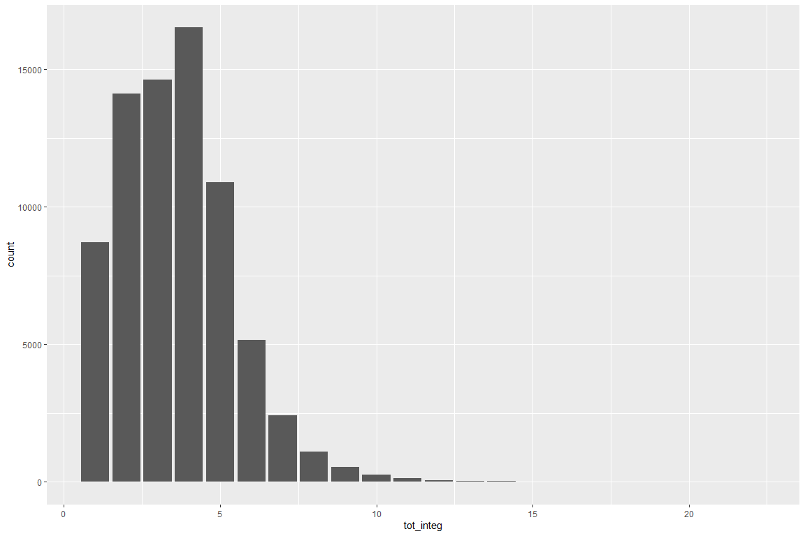<!-- -->
Se observar que hay hogares con muchos integrantes pero es algo atípico

``` r
enigh%>%
  count(tot_integ)
```

    ## # A tibble: 20 × 2
    ##    tot_integ     n
    ##        <dbl> <int>
    ##  1         1  8711
    ##  2         2 14129
    ##  3         3 14624
    ##  4         4 16520
    ##  5         5 10887
    ##  6         6  5173
    ##  7         7  2413
    ##  8         8  1097
    ##  9         9   544
    ## 10        10   261
    ## 11        11   141
    ## 12        12    62
    ## 13        13    39
    ## 14        14    24
    ## 15        15     7
    ## 16        16    10
    ## 17        17     1
    ## 18        18     2
    ## 19        20     1
    ## 20        22     1

``` r
enigh%>%
  group_by(tot_integ)%>%
  summarise(n = n())
```

    ## # A tibble: 20 × 2
    ##    tot_integ     n
    ##        <dbl> <int>
    ##  1         1  8711
    ##  2         2 14129
    ##  3         3 14624
    ##  4         4 16520
    ##  5         5 10887
    ##  6         6  5173
    ##  7         7  2413
    ##  8         8  1097
    ##  9         9   544
    ## 10        10   261
    ## 11        11   141
    ## 12        12    62
    ## 13        13    39
    ## 14        14    24
    ## 15        15     7
    ## 16        16    10
    ## 17        17     1
    ## 18        18     2
    ## 19        20     1
    ## 20        22     1

``` r
ggplot(enigh)+
  geom_histogram(mapping = aes(x = ing_cor), binwidth = 1000)
```

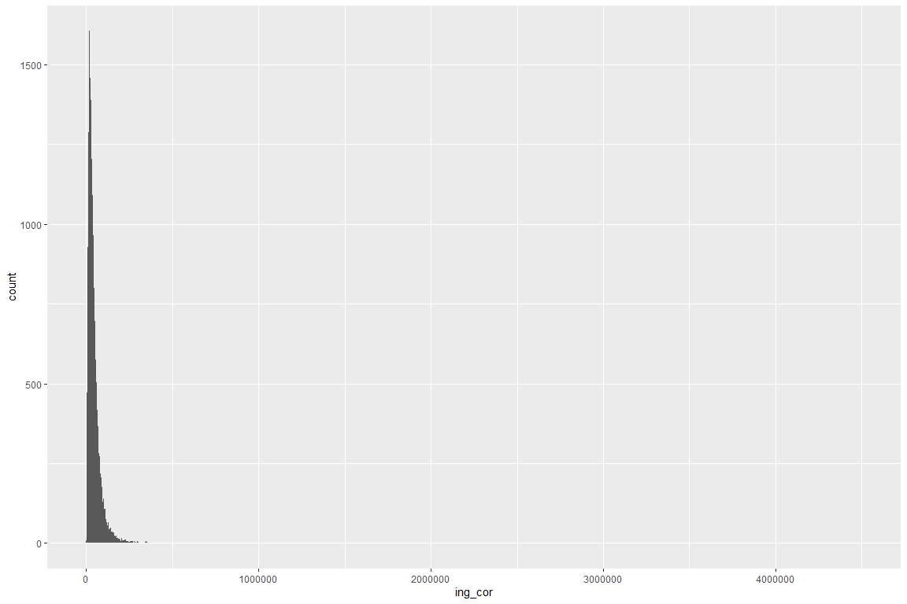<!-- -->
binwidth permite especificar los intervalos

``` r
enigh%>%
  count(cut_width(ing_cor,1000, boundary=0))
```

    ## # A tibble: 509 × 2
    ##    `cut_width(ing_cor, 1000, boundary = 0)`     n
    ##    <fct>                                    <int>
    ##  1 [0,1000]                                    14
    ##  2 (1000,2000]                                 33
    ##  3 (2000,3000]                                106
    ##  4 (3000,4000]                                223
    ##  5 (4000,5000]                                394
    ##  6 (5000,6000]                                542
    ##  7 (6000,7000]                                683
    ##  8 (7000,8000]                                780
    ##  9 (8000,9000]                                898
    ## 10 (9000,1e+04]                               922
    ## # ℹ 499 more rows

``` r
ingresos <- enigh%>%
  filter(ing_cor<100000)

ingresos
```

    ## # A tibble: 69,046 × 26
    ##    folioviv  foliohog ubica_geo tam_loc est_socio est_dis upm   factor clase_hog
    ##    <chr>        <dbl> <chr>       <dbl>     <dbl> <chr>   <chr>  <dbl>     <dbl>
    ##  1 01000136…        1 01001           1         3 002     0000…    175         2
    ##  2 01000136…        1 01001           1         3 002     0000…    175         2
    ##  3 01000136…        1 01001           1         3 002     0000…    175         2
    ##  4 01000136…        1 01001           1         3 002     0000…    175         2
    ##  5 01000267…        1 01001           1         3 002     0000…    189         1
    ##  6 01000267…        1 01001           1         3 002     0000…    189         2
    ##  7 01000272…        1 01001           1         3 002     0000…    186         2
    ##  8 01000272…        1 01001           1         3 002     0000…    186         1
    ##  9 01000272…        1 01001           1         3 002     0000…    186         2
    ## 10 01000455…        1 01001           1         3 002     0000…    186         2
    ## # ℹ 69,036 more rows
    ## # ℹ 17 more variables: sexo_jefe <dbl>, edad_jefe <dbl>, educa_jefe <chr>,
    ## #   tot_integ <dbl>, percep_ing <dbl>, ing_cor <dbl>, ingtrab <dbl>,
    ## #   gasto_mon <dbl>, alimentos <dbl>, vesti_calz <dbl>, vivienda <dbl>,
    ## #   limpieza <dbl>, salud <dbl>, transporte <dbl>, educa_espa <dbl>,
    ## #   personales <dbl>, transf_gas <dbl>

``` r
ggplot(ingresos)+
  geom_histogram(mapping = aes(x=ing_cor), binwidth = 1000)
```

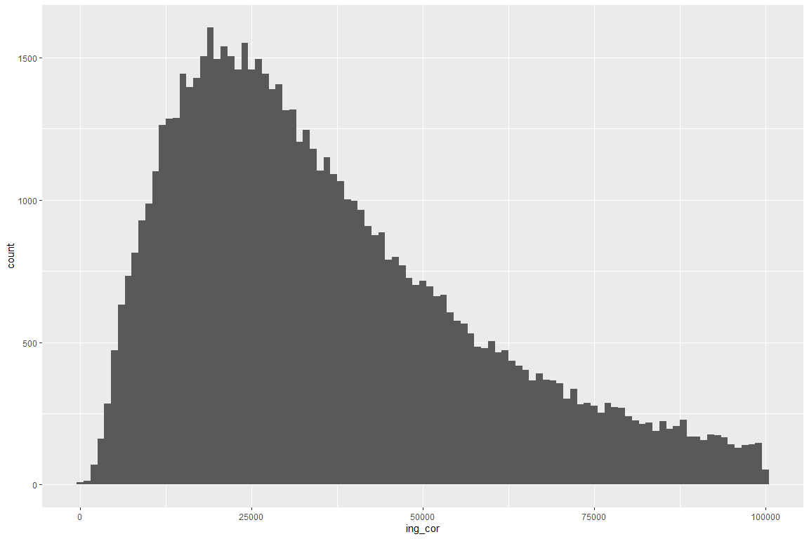<!-- -->

``` r
ingresos <- enigh%>%
  filter(ing_cor<200000)

ingresos
```

    ## # A tibble: 73,718 × 26
    ##    folioviv  foliohog ubica_geo tam_loc est_socio est_dis upm   factor clase_hog
    ##    <chr>        <dbl> <chr>       <dbl>     <dbl> <chr>   <chr>  <dbl>     <dbl>
    ##  1 01000136…        1 01001           1         3 002     0000…    175         2
    ##  2 01000136…        1 01001           1         3 002     0000…    175         2
    ##  3 01000136…        1 01001           1         3 002     0000…    175         2
    ##  4 01000136…        1 01001           1         3 002     0000…    175         2
    ##  5 01000267…        1 01001           1         3 002     0000…    189         1
    ##  6 01000267…        1 01001           1         3 002     0000…    189         2
    ##  7 01000267…        1 01001           1         3 002     0000…    189         2
    ##  8 01000272…        1 01001           1         3 002     0000…    186         3
    ##  9 01000272…        1 01001           1         3 002     0000…    186         2
    ## 10 01000272…        1 01001           1         3 002     0000…    186         1
    ## # ℹ 73,708 more rows
    ## # ℹ 17 more variables: sexo_jefe <dbl>, edad_jefe <dbl>, educa_jefe <chr>,
    ## #   tot_integ <dbl>, percep_ing <dbl>, ing_cor <dbl>, ingtrab <dbl>,
    ## #   gasto_mon <dbl>, alimentos <dbl>, vesti_calz <dbl>, vivienda <dbl>,
    ## #   limpieza <dbl>, salud <dbl>, transporte <dbl>, educa_espa <dbl>,
    ## #   personales <dbl>, transf_gas <dbl>

``` r
ggplot(ingresos)+
  geom_histogram(mapping = aes(x=ing_cor), binwidth = 1000)
```

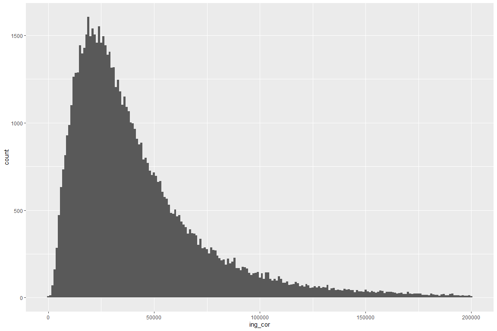<!-- -->

### GSub

Permite cambiar un valor por otro en una columna de una tabla

``` r
ingresos$clase_hog <- gsub(1,"Unipersonal", ingresos$clase_hog)
ingresos$clase_hog <- gsub(2,"Nuclear", ingresos$clase_hog)
ingresos$clase_hog <- gsub(3,"Ampliado", ingresos$clase_hog)
ingresos$clase_hog <- gsub(4,"Compuesto", ingresos$clase_hog)
ingresos$clase_hog <- gsub(5,"Corresidnte", ingresos$clase_hog)
```

``` r
ggplot(ingresos, mapping=aes(x=ing_cor, color = clase_hog))+
  geom_histogram(binwidth = 1000)
```

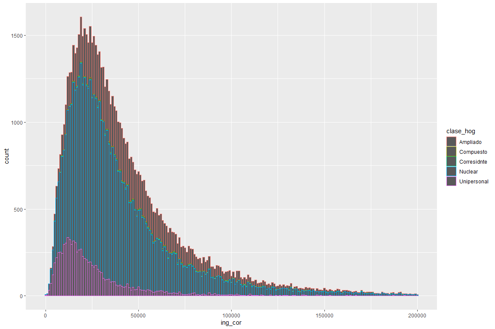<!-- -->

Se ve que el histograma no funciona porque cubre algunas clases, para
eso está la geometría “freqpoy”. Este no tiene fondo

``` r
ggplot(data = ingresos, mapping = aes(x=ing_cor, color = clase_hog))+
  geom_freqpoly(binwidth = 1000)
```

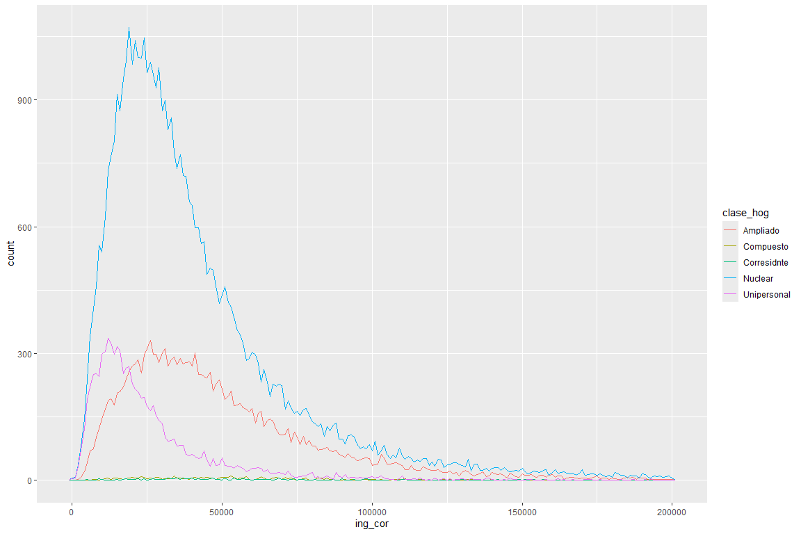<!-- -->

### VALORES TÍPICOS

``` r
ggplot(data = enigh)+
  geom_histogram(mapping = aes(x = ingtrab), binwidth = 1000)
```

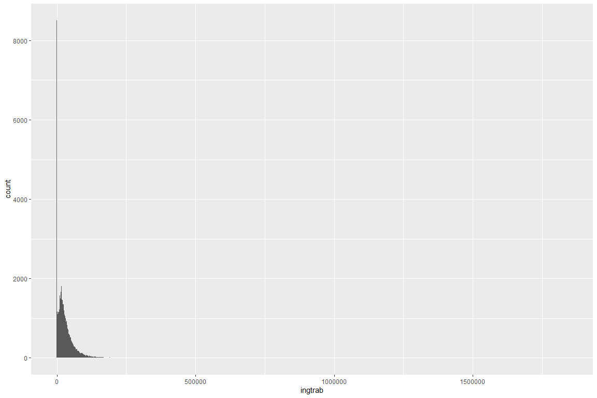<!-- -->

Hay MUCHOS valores atípicos. Se puede filtarr el dataframe, pero también
se puede filtrar el eje

``` r
ggplot(enigh)+
  geom_histogram(mapping = aes(x = ingtrab), binwidth = 1000)+
  coord_cartesian(xlim = c(0,150000))
```

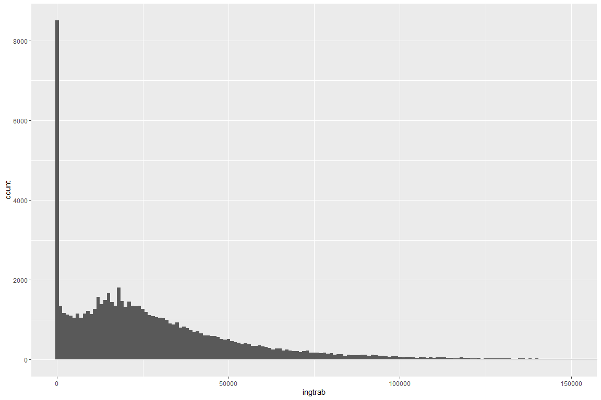<!-- -->
Mucha gente vive de ingresos como inversiones, del gobierno, etc

``` r
ingresos_trabajo <- enigh%>%
  filter(ingtrab > 0 & ingtrab < 150000)

ingresos_trabajo
```

    ## # A tibble: 66,137 × 26
    ##    folioviv  foliohog ubica_geo tam_loc est_socio est_dis upm   factor clase_hog
    ##    <chr>        <dbl> <chr>       <dbl>     <dbl> <chr>   <chr>  <dbl>     <dbl>
    ##  1 01000136…        1 01001           1         3 002     0000…    175         2
    ##  2 01000136…        1 01001           1         3 002     0000…    175         2
    ##  3 01000136…        1 01001           1         3 002     0000…    175         2
    ##  4 01000136…        1 01001           1         3 002     0000…    175         2
    ##  5 01000267…        1 01001           1         3 002     0000…    189         2
    ##  6 01000267…        1 01001           1         3 002     0000…    189         1
    ##  7 01000267…        1 01001           1         3 002     0000…    189         2
    ##  8 01000272…        1 01001           1         3 002     0000…    186         3
    ##  9 01000272…        1 01001           1         3 002     0000…    186         2
    ## 10 01000272…        1 01001           1         3 002     0000…    186         1
    ## # ℹ 66,127 more rows
    ## # ℹ 17 more variables: sexo_jefe <dbl>, edad_jefe <dbl>, educa_jefe <chr>,
    ## #   tot_integ <dbl>, percep_ing <dbl>, ing_cor <dbl>, ingtrab <dbl>,
    ## #   gasto_mon <dbl>, alimentos <dbl>, vesti_calz <dbl>, vivienda <dbl>,
    ## #   limpieza <dbl>, salud <dbl>, transporte <dbl>, educa_espa <dbl>,
    ## #   personales <dbl>, transf_gas <dbl>

``` r
ggplot(ingresos_trabajo)+
  geom_histogram(mapping = aes(x=ingtrab), binwidth = 10000)
```

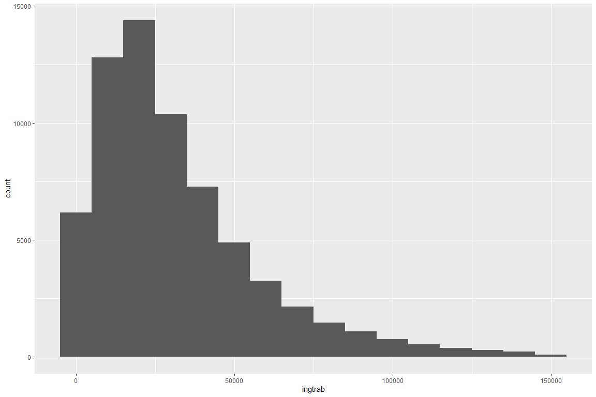<!-- -->

``` r
ingresos_trabajo$sexo_jefe <- gsub(1, "Hombre", ingresos_trabajo$sexo_jefe)

ingresos_trabajo$sexo_jefe <- gsub(2, "Mujer", ingresos_trabajo$sexo_jefe)
```

``` r
ggplot(ingresos_trabajo, mapping = aes(x=ingtrab, color = sexo_jefe))+
  geom_freqpoly(binwidth = 2000)
```

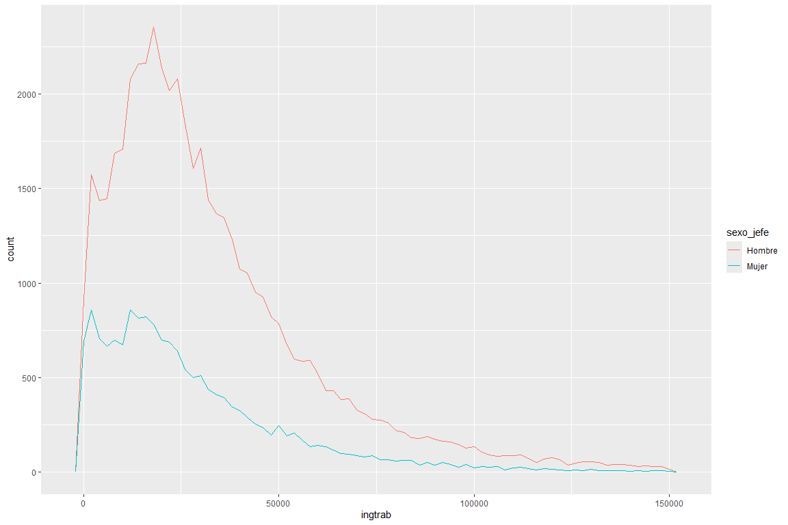<!-- -->

### VALORES PERDIDOS

Se pueden cambiar los valores dentro de un data frame por NA’s

``` r
summary(enigh$ing_cor)
```

    ##    Min. 1st Qu.  Median    Mean 3rd Qu.    Max. 
    ##       0   20345   33573   46044   55196 4501830

``` r
enigh <- enigh%>%
  mutate(ing_cor=ifelse(ing_cor==0 | ing_cor > 200000, NA, ing_cor))

summary(enigh$ing_cor)
```

    ##     Min.  1st Qu.   Median     Mean  3rd Qu.     Max.     NA's 
    ##    381.3  20183.7  33180.8  42215.6  53971.2 199967.2      937

Esto me ermite graficar ignorando los valores extremos

``` r
ggplot(data = enigh, mapping = aes(x=edad_jefe, y = ing_cor))+
  geom_point()
```

    ## Warning: Removed 937 rows containing missing values or values outside the scale range
    ## (`geom_point()`).

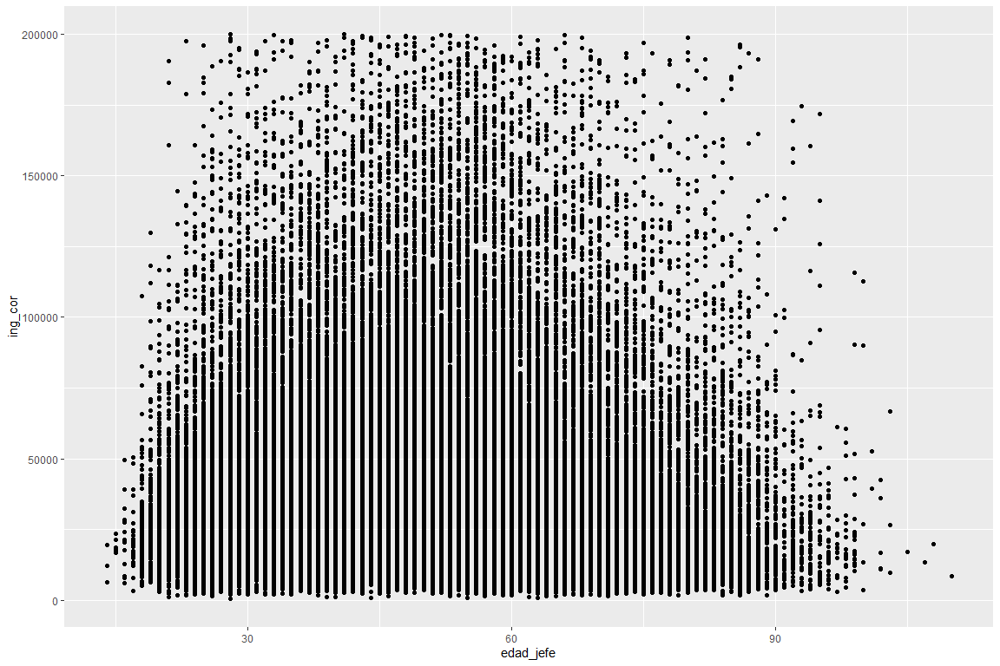<!-- -->

``` r
ggplot(data = enigh, mapping = aes(x=edad_jefe, y = ing_cor))+
  geom_point(na.rm = T)
```

<!-- -->
Esto hace que ignore los NA’s

### Covariación - categorica con continua

Es el comportamiento entre variables. Depende de los tipos de variables
que se trabajan

1.  Categórica con continua

``` r
summary(enigh$sexo_jefe)
```

    ##    Min. 1st Qu.  Median    Mean 3rd Qu.    Max. 
    ##   1.000   1.000   1.000   1.274   2.000   2.000

Es una variable categórica pero por ser números es continua

``` r
enigh$sexo_jefe <- gsub(1, "Hombre", enigh$sexo_jefe)
enigh$sexo_jefe <- gsub(2, "Mujer", enigh$sexo_jefe)

enigh$clase_hog <- gsub(1,"Unipersonal", enigh$clase_hog)
enigh$clase_hog <- gsub(2,"Nuclear", enigh$clase_hog)
enigh$clase_hog <- gsub(3,"Ampliado", enigh$clase_hog)
enigh$clase_hog <- gsub(4,"Compuesto", enigh$clase_hog)
enigh$clase_hog <- gsub(5,"Corresidnte", enigh$clase_hog)
```

``` r
ggplot(data = na.omit(enigh), mapping = aes(x = ing_cor, color =clase_hog))+
  geom_freqpoly(binwidth = 10000)
```

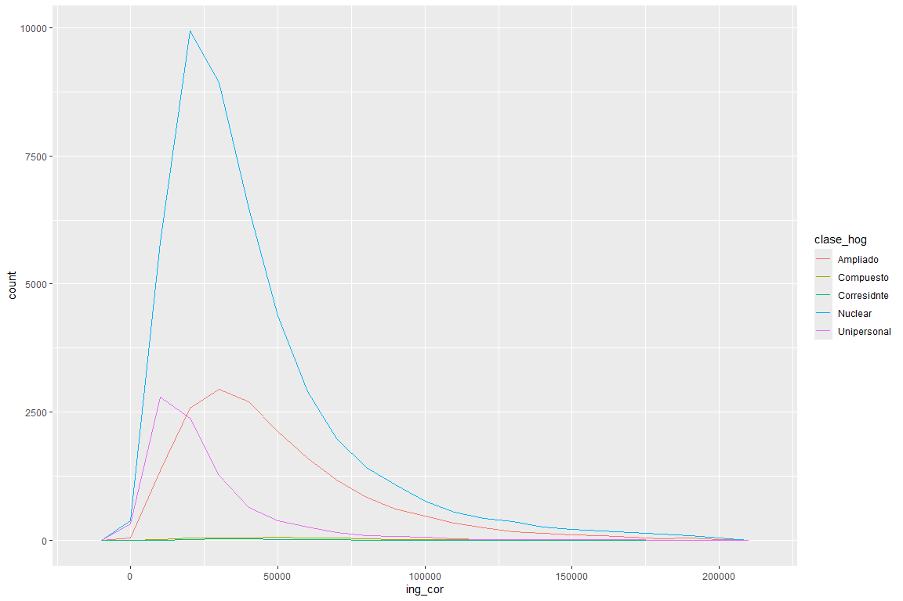<!-- -->
“na.omit” hace que no se tomen los NA’s en el gráfico

No nos casamos con esta porque hay mucha diferencia entre los hogares
nucleares y el resto de los hogares.

Se puede hacer una gráfica de barras por proporción

``` r
ggplot(data = na.omit(enigh))+
  geom_bar(mapping = aes(x = clase_hog, y = ..prop.., group = 1))
```

    ## Warning: The dot-dot notation (`..prop..`) was deprecated in ggplot2 3.4.0.
    ## ℹ Please use `after_stat(prop)` instead.
    ## This warning is displayed once every 8 hours.
    ## Call `lifecycle::last_lifecycle_warnings()` to see where this warning was
    ## generated.

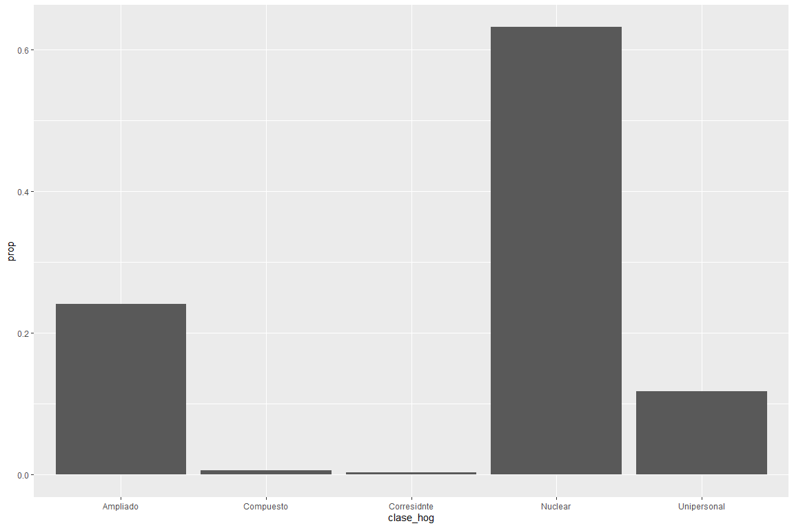<!-- -->

El ingreso per capita permite hacer una ponderación por el número de
personas

``` r
enigh <- enigh%>%
  mutate(ing_per_cap = ing_cor/tot_integ)

enigh
```

    ## # A tibble: 74,647 × 27
    ##    folioviv  foliohog ubica_geo tam_loc est_socio est_dis upm   factor clase_hog
    ##    <chr>        <dbl> <chr>       <dbl>     <dbl> <chr>   <chr>  <dbl> <chr>    
    ##  1 01000136…        1 01001           1         3 002     0000…    175 Nuclear  
    ##  2 01000136…        1 01001           1         3 002     0000…    175 Nuclear  
    ##  3 01000136…        1 01001           1         3 002     0000…    175 Nuclear  
    ##  4 01000136…        1 01001           1         3 002     0000…    175 Nuclear  
    ##  5 01000136…        1 01001           1         3 002     0000…    175 Nuclear  
    ##  6 01000267…        1 01001           1         3 002     0000…    189 Nuclear  
    ##  7 01000267…        1 01001           1         3 002     0000…    189 Uniperso…
    ##  8 01000267…        1 01001           1         3 002     0000…    189 Nuclear  
    ##  9 01000267…        1 01001           1         3 002     0000…    189 Nuclear  
    ## 10 01000272…        1 01001           1         3 002     0000…    186 Ampliado 
    ## # ℹ 74,637 more rows
    ## # ℹ 18 more variables: sexo_jefe <chr>, edad_jefe <dbl>, educa_jefe <chr>,
    ## #   tot_integ <dbl>, percep_ing <dbl>, ing_cor <dbl>, ingtrab <dbl>,
    ## #   gasto_mon <dbl>, alimentos <dbl>, vesti_calz <dbl>, vivienda <dbl>,
    ## #   limpieza <dbl>, salud <dbl>, transporte <dbl>, educa_espa <dbl>,
    ## #   personales <dbl>, transf_gas <dbl>, ing_per_cap <dbl>

``` r
ggplot(data = na.omit(enigh))+
  geom_boxplot(mapping = aes(x=clase_hog, y = ing_per_cap))
```

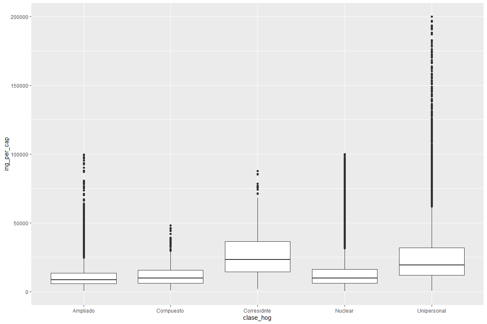<!-- -->

### Covariación - categorica con categorica

Son dos variables que no son muy buenas para graficar por si solas

``` r
enigh$educa_jefe <- gsub("01", "Preescolar", enigh$educa_jefe)
enigh$educa_jefe <- gsub("02", "Primaria incompletar", enigh$educa_jefe)
enigh$educa_jefe <- gsub("03", "Primaria completa", enigh$educa_jefe)
enigh$educa_jefe <- gsub("04", "Preescolar", enigh$educa_jefe)
enigh$educa_jefe <- gsub("05", "Secundaria incompleta", enigh$educa_jefe)
enigh$educa_jefe <- gsub("06", "Secundaria completa", enigh$educa_jefe)
enigh$educa_jefe <- gsub("07", "Preparatoria incompleta", enigh$educa_jefe)
enigh$educa_jefe <- gsub("08", "Preparatoria completa", enigh$educa_jefe)
enigh$educa_jefe <- gsub("09", "Preescolar", enigh$educa_jefe)
enigh$educa_jefe <- gsub("10", "Profesional incompleta", enigh$educa_jefe)
enigh$educa_jefe <- gsub("11", "Posgrado", enigh$educa_jefe)
```

``` r
ggplot(data = enigh)+
  geom_count(mapping = aes(x=clase_hog, y=educa_jefe))
```

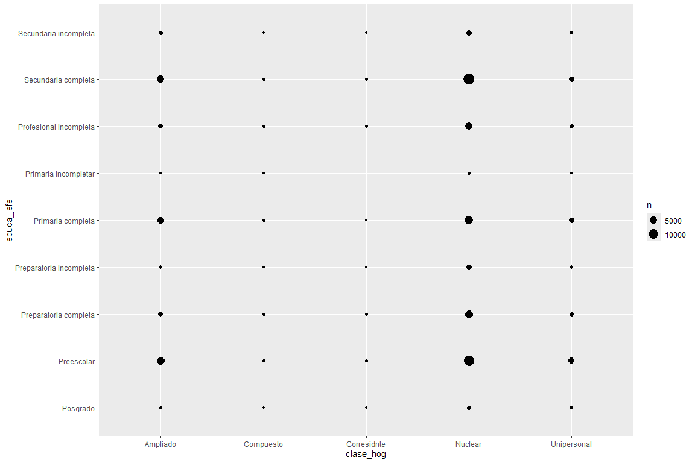<!-- -->
“geom_count” permite hacer un gráfico de circulos. Si no se hace una
especificación, se organizan los ejes por orden alfabétic.

Se puede hacer tambien en tablas.

``` r
enigh%>%
  count(educa_jefe, clase_hog)
```

    ## # A tibble: 44 × 3
    ##    educa_jefe clase_hog       n
    ##    <chr>      <chr>       <int>
    ##  1 Posgrado   Ampliado      182
    ##  2 Posgrado   Compuesto       3
    ##  3 Posgrado   Corresidnte     9
    ##  4 Posgrado   Nuclear       864
    ##  5 Posgrado   Unipersonal   204
    ##  6 Preescolar Ampliado     5902
    ##  7 Preescolar Compuesto     146
    ##  8 Preescolar Corresidnte    67
    ##  9 Preescolar Nuclear     11546
    ## 10 Preescolar Unipersonal  2808
    ## # ℹ 34 more rows

El mapa de calor también es muy util para ver esto

``` r
enighh <- enigh%>%
  count(educa_jefe, clase_hog)

ggplot(data = na.omit(enighh))+
  geom_tile(mapping=aes(x=clase_hog, y = educa_jefe, fill=n))
```

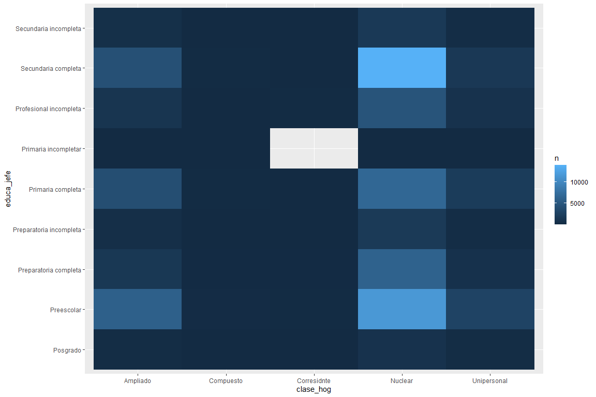<!-- -->

``` r
enighhh <- enigh%>%
  count(educa_jefe, sexo_jefe)

ggplot(data = na.omit(enighhh))+
  geom_tile(mapping=aes(x=sexo_jefe, y = educa_jefe, fill=n))
```

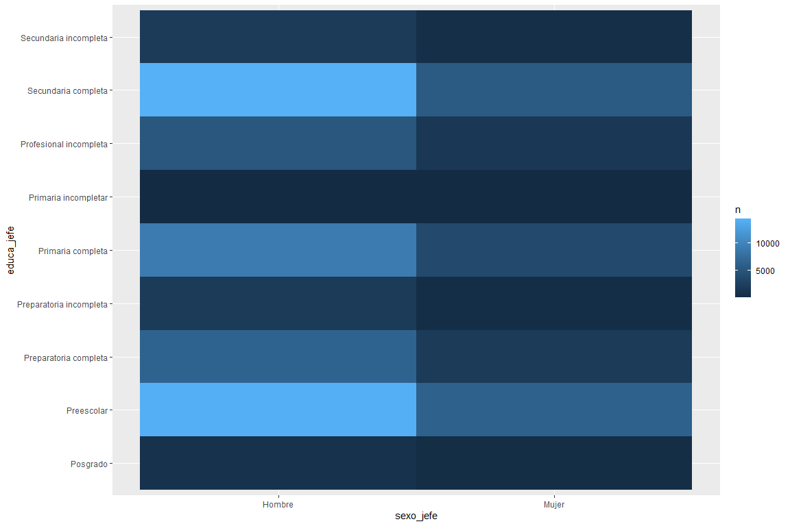<!-- -->
