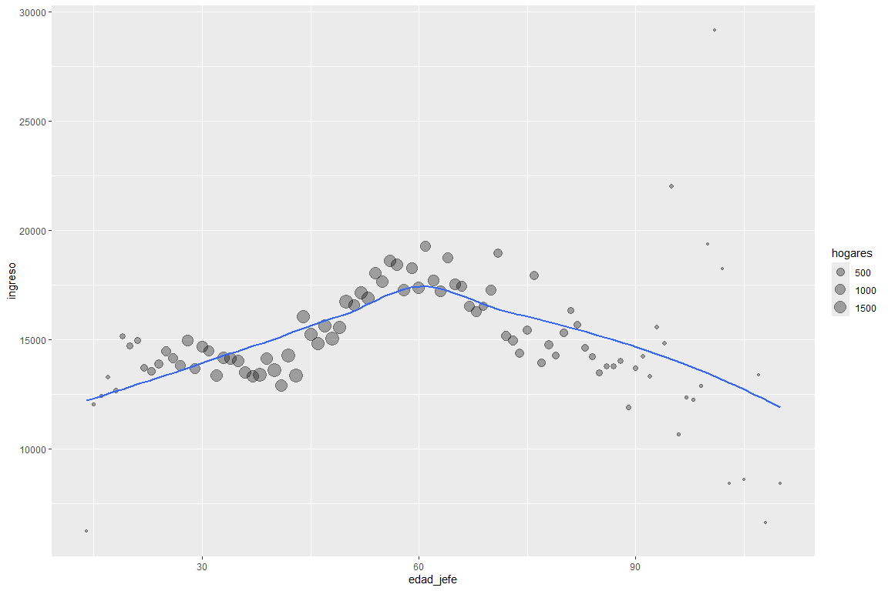
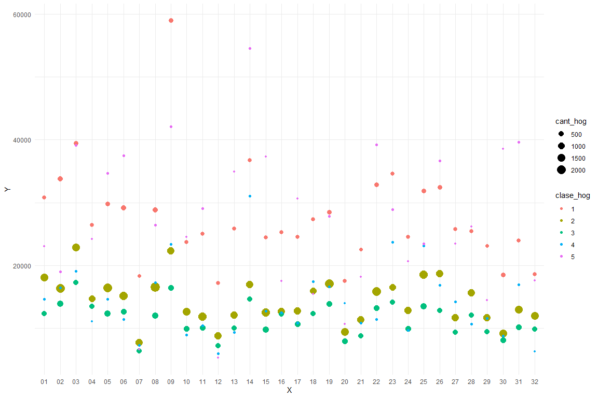

Transformación y exploración de datos
================

``` r
knitr::opts_chunk$set(fig.width=12, fig.height=8)
```

``` r
#install.packages("tidyverse")
library(tidyverse)
```

    ## Warning: package 'tidyverse' was built under R version 4.2.3

    ## Warning: package 'ggplot2' was built under R version 4.2.3

    ## Warning: package 'tibble' was built under R version 4.2.3

    ## Warning: package 'tidyr' was built under R version 4.2.3

    ## Warning: package 'readr' was built under R version 4.2.3

    ## Warning: package 'purrr' was built under R version 4.2.3

    ## Warning: package 'dplyr' was built under R version 4.2.3

    ## Warning: package 'stringr' was built under R version 4.2.3

    ## Warning: package 'forcats' was built under R version 4.2.3

    ## Warning: package 'lubridate' was built under R version 4.2.3

    ## ── Attaching core tidyverse packages ──────────────────────── tidyverse 2.0.0 ──
    ## ✔ dplyr     1.1.4     ✔ readr     2.1.5
    ## ✔ forcats   1.0.0     ✔ stringr   1.5.1
    ## ✔ ggplot2   3.5.0     ✔ tibble    3.2.1
    ## ✔ lubridate 1.9.3     ✔ tidyr     1.3.1
    ## ✔ purrr     1.0.2     
    ## ── Conflicts ────────────────────────────────────────── tidyverse_conflicts() ──
    ## ✖ dplyr::filter() masks stats::filter()
    ## ✖ dplyr::lag()    masks stats::lag()
    ## ℹ Use the conflicted package (<http://conflicted.r-lib.org/>) to force all conflicts to become errors

``` r
options(scipen = 999) #Es para evitar la notación científica
```

``` r
enigh <- read_csv("C:/Users/david/OneDrive/Escritorio/Personal/a2/Curso - R/4. Transformacion_y_exploracion/hogares_enigh.csv")
```

    ## Rows: 74647 Columns: 26
    ## ── Column specification ────────────────────────────────────────────────────────
    ## Delimiter: ","
    ## chr  (5): folioviv, ubica_geo, est_dis, upm, educa_jefe
    ## dbl (21): foliohog, tam_loc, est_socio, factor, clase_hog, sexo_jefe, edad_j...
    ## 
    ## ℹ Use `spec()` to retrieve the full column specification for this data.
    ## ℹ Specify the column types or set `show_col_types = FALSE` to quiet this message.

### FILTER

``` r
filter(enigh, clase_hog==2)
```

    ## # A tibble: 47,174 × 26
    ##    folioviv  foliohog ubica_geo tam_loc est_socio est_dis upm   factor clase_hog
    ##    <chr>        <dbl> <chr>       <dbl>     <dbl> <chr>   <chr>  <dbl>     <dbl>
    ##  1 01000136…        1 01001           1         3 002     0000…    175         2
    ##  2 01000136…        1 01001           1         3 002     0000…    175         2
    ##  3 01000136…        1 01001           1         3 002     0000…    175         2
    ##  4 01000136…        1 01001           1         3 002     0000…    175         2
    ##  5 01000136…        1 01001           1         3 002     0000…    175         2
    ##  6 01000267…        1 01001           1         3 002     0000…    189         2
    ##  7 01000267…        1 01001           1         3 002     0000…    189         2
    ##  8 01000267…        1 01001           1         3 002     0000…    189         2
    ##  9 01000272…        1 01001           1         3 002     0000…    186         2
    ## 10 01000272…        1 01001           1         3 002     0000…    186         2
    ## # ℹ 47,164 more rows
    ## # ℹ 17 more variables: sexo_jefe <dbl>, edad_jefe <dbl>, educa_jefe <chr>,
    ## #   tot_integ <dbl>, percep_ing <dbl>, ing_cor <dbl>, ingtrab <dbl>,
    ## #   gasto_mon <dbl>, alimentos <dbl>, vesti_calz <dbl>, vivienda <dbl>,
    ## #   limpieza <dbl>, salud <dbl>, transporte <dbl>, educa_espa <dbl>,
    ## #   personales <dbl>, transf_gas <dbl>

``` r
hogares_nucleares <- filter(enigh, clase_hog == 2)
```

``` r
hogares_nucleares_jfem <- filter(enigh, clase_hog == 2, sexo_jefe == 2)
```

``` r
hogares_jfem <- filter(enigh, (clase_hog == 1 | clase_hog == 2), sexo_jefe == 2)
```

“\|” es una “o”

``` r
hogares_uni_jmas <- filter(enigh, clase_hog == 1, sexo_jefe == 1)
```

### ARRANGE

``` r
arrange(enigh, edad_jefe)
```

    ## # A tibble: 74,647 × 26
    ##    folioviv  foliohog ubica_geo tam_loc est_socio est_dis upm   factor clase_hog
    ##    <chr>        <dbl> <chr>       <dbl>     <dbl> <chr>   <chr>  <dbl>     <dbl>
    ##  1 07008528…        1 07089           1         1 101     0001…    481         1
    ##  2 24609059…        1 24047           4         1 388     0006…    233         3
    ##  3 30637158…        1 30163           4         1 515     0007…    727         3
    ##  4 15193570…        1 15122           1         2 229     0004…   1754         1
    ##  5 16606578…        3 16017           4         1 265     0004…    685         2
    ##  6 30090517…        1 30104           3         1 513     0007…   1179         3
    ##  7 30626049…        1 30143           4         1 515     0007…    661         1
    ##  8 31603288…        2 31076           4         1 531     0008…     93         2
    ##  9 32012206…        1 32005           2         2 538     0008…    209         2
    ## 10 01005524…        1 01001           1         2 001     0000…    147         2
    ## # ℹ 74,637 more rows
    ## # ℹ 17 more variables: sexo_jefe <dbl>, edad_jefe <dbl>, educa_jefe <chr>,
    ## #   tot_integ <dbl>, percep_ing <dbl>, ing_cor <dbl>, ingtrab <dbl>,
    ## #   gasto_mon <dbl>, alimentos <dbl>, vesti_calz <dbl>, vivienda <dbl>,
    ## #   limpieza <dbl>, salud <dbl>, transporte <dbl>, educa_espa <dbl>,
    ## #   personales <dbl>, transf_gas <dbl>

``` r
arrange(enigh, sexo_jefe, edad_jefe)
```

    ## # A tibble: 74,647 × 26
    ##    folioviv  foliohog ubica_geo tam_loc est_socio est_dis upm   factor clase_hog
    ##    <chr>        <dbl> <chr>       <dbl>     <dbl> <chr>   <chr>  <dbl>     <dbl>
    ##  1 07008528…        1 07089           1         1 101     0001…    481         1
    ##  2 15193570…        1 15122           1         2 229     0004…   1754         1
    ##  3 16606578…        3 16017           4         1 265     0004…    685         2
    ##  4 30090517…        1 30104           3         1 513     0007…   1179         3
    ##  5 30626049…        1 30143           4         1 515     0007…    661         1
    ##  6 01005524…        1 01001           1         2 001     0000…    147         2
    ##  7 07624669…        1 07111           4         1 114     0002…    866         2
    ##  8 12034418…        1 12055           2         2 189     0003…    538         2
    ##  9 14143674…        1 14100           3         3 224     0003…   1275         3
    ## 10 15621680…        3 15124           4         1 247     0004…    504         2
    ## # ℹ 74,637 more rows
    ## # ℹ 17 more variables: sexo_jefe <dbl>, edad_jefe <dbl>, educa_jefe <chr>,
    ## #   tot_integ <dbl>, percep_ing <dbl>, ing_cor <dbl>, ingtrab <dbl>,
    ## #   gasto_mon <dbl>, alimentos <dbl>, vesti_calz <dbl>, vivienda <dbl>,
    ## #   limpieza <dbl>, salud <dbl>, transporte <dbl>, educa_espa <dbl>,
    ## #   personales <dbl>, transf_gas <dbl>

organiza primero la primera variable escrita

### SELECT

``` r
colnames(enigh)
```

    ##  [1] "folioviv"   "foliohog"   "ubica_geo"  "tam_loc"    "est_socio" 
    ##  [6] "est_dis"    "upm"        "factor"     "clase_hog"  "sexo_jefe" 
    ## [11] "edad_jefe"  "educa_jefe" "tot_integ"  "percep_ing" "ing_cor"   
    ## [16] "ingtrab"    "gasto_mon"  "alimentos"  "vesti_calz" "vivienda"  
    ## [21] "limpieza"   "salud"      "transporte" "educa_espa" "personales"
    ## [26] "transf_gas"

``` r
enigh_corto <- select(enigh, folioviv, foliohog, ing_cor, gasto_mon, tot_integ, ubica_geo, sexo_jefe, clase_hog, edad_jefe)

enigh_corto
```

    ## # A tibble: 74,647 × 9
    ##    folioviv   foliohog ing_cor gasto_mon tot_integ ubica_geo sexo_jefe clase_hog
    ##    <chr>         <dbl>   <dbl>     <dbl>     <dbl> <chr>         <dbl>     <dbl>
    ##  1 0100013601        1  76404.    18551.         3 01001             1         2
    ##  2 0100013602        1  42988.    55471.         5 01001             1         2
    ##  3 0100013603        1 580698.   103107.         2 01001             1         2
    ##  4 0100013604        1  46253.    19340.         2 01001             2         2
    ##  5 0100013606        1  53837.    13605.         4 01001             2         2
    ##  6 0100026701        1 237743.    33628.         4 01001             2         2
    ##  7 0100026703        1  32607.    33311.         1 01001             2         1
    ##  8 0100026704        1 169918.    87119.         2 01001             1         2
    ##  9 0100026706        1  17311.    14347.         3 01001             1         2
    ## 10 0100027201        1 120488.    52373.         4 01001             1         3
    ## # ℹ 74,637 more rows
    ## # ℹ 1 more variable: edad_jefe <dbl>

``` r
enigh_corto_dos <- select(enigh, folioviv:sexo_jefe)

enigh_corto_dos
```

    ## # A tibble: 74,647 × 10
    ##    folioviv  foliohog ubica_geo tam_loc est_socio est_dis upm   factor clase_hog
    ##    <chr>        <dbl> <chr>       <dbl>     <dbl> <chr>   <chr>  <dbl>     <dbl>
    ##  1 01000136…        1 01001           1         3 002     0000…    175         2
    ##  2 01000136…        1 01001           1         3 002     0000…    175         2
    ##  3 01000136…        1 01001           1         3 002     0000…    175         2
    ##  4 01000136…        1 01001           1         3 002     0000…    175         2
    ##  5 01000136…        1 01001           1         3 002     0000…    175         2
    ##  6 01000267…        1 01001           1         3 002     0000…    189         2
    ##  7 01000267…        1 01001           1         3 002     0000…    189         1
    ##  8 01000267…        1 01001           1         3 002     0000…    189         2
    ##  9 01000267…        1 01001           1         3 002     0000…    189         2
    ## 10 01000272…        1 01001           1         3 002     0000…    186         3
    ## # ℹ 74,637 more rows
    ## # ℹ 1 more variable: sexo_jefe <dbl>

Para conservar un rango de columnas

``` r
enigh_corto_tres <- select(enigh, folioviv:sexo_jefe, gasto_mon)
enigh_corto_tres
```

    ## # A tibble: 74,647 × 11
    ##    folioviv  foliohog ubica_geo tam_loc est_socio est_dis upm   factor clase_hog
    ##    <chr>        <dbl> <chr>       <dbl>     <dbl> <chr>   <chr>  <dbl>     <dbl>
    ##  1 01000136…        1 01001           1         3 002     0000…    175         2
    ##  2 01000136…        1 01001           1         3 002     0000…    175         2
    ##  3 01000136…        1 01001           1         3 002     0000…    175         2
    ##  4 01000136…        1 01001           1         3 002     0000…    175         2
    ##  5 01000136…        1 01001           1         3 002     0000…    175         2
    ##  6 01000267…        1 01001           1         3 002     0000…    189         2
    ##  7 01000267…        1 01001           1         3 002     0000…    189         1
    ##  8 01000267…        1 01001           1         3 002     0000…    189         2
    ##  9 01000267…        1 01001           1         3 002     0000…    189         2
    ## 10 01000272…        1 01001           1         3 002     0000…    186         3
    ## # ℹ 74,637 more rows
    ## # ℹ 2 more variables: sexo_jefe <dbl>, gasto_mon <dbl>

Para eliminar una columna o un rango de columnas

``` r
select(enigh, -(folioviv:percep_ing))
```

    ## # A tibble: 74,647 × 12
    ##    ing_cor ingtrab gasto_mon alimentos vesti_calz vivienda limpieza   salud
    ##      <dbl>   <dbl>     <dbl>     <dbl>      <dbl>    <dbl>    <dbl>   <dbl>
    ##  1  76404.  53115.    18551.     5618.        0      3912      522      0  
    ##  2  42988.  15235.    55471.    20930.      401.     2495      412.  1349. 
    ##  3 580698. 141885.   103107.    37594.     2015.     4475     3318. 28859. 
    ##  4  46253.      0     19340.     2893.       97.8    1458     5514    323. 
    ##  5  53837.  43229.    13605.     7367.        0       300     3300     56.7
    ##  6 237743. 129836.    33628.        0         0      2801     5682      0  
    ##  7  32607.  23607.    33311.    11456.        0      4405     2497.  4696. 
    ##  8 169918. 154918.    87119.    30986.     1565.     1050    10376.     0  
    ##  9  17311.  17311.    14347.     5773.      533.     4740      771     48.9
    ## 10 120488.  44761.    52373.     3986.     1174.    16199.     784.  8217. 
    ## # ℹ 74,637 more rows
    ## # ℹ 4 more variables: transporte <dbl>, educa_espa <dbl>, personales <dbl>,
    ## #   transf_gas <dbl>

``` r
select(enigh, starts_with("fol"))
```

    ## # A tibble: 74,647 × 2
    ##    folioviv   foliohog
    ##    <chr>         <dbl>
    ##  1 0100013601        1
    ##  2 0100013602        1
    ##  3 0100013603        1
    ##  4 0100013604        1
    ##  5 0100013606        1
    ##  6 0100026701        1
    ##  7 0100026703        1
    ##  8 0100026704        1
    ##  9 0100026706        1
    ## 10 0100027201        1
    ## # ℹ 74,637 more rows

``` r
select(enigh, ends_with("s"))
```

    ## # A tibble: 74,647 × 4
    ##    est_dis alimentos personales transf_gas
    ##    <chr>       <dbl>      <dbl>      <dbl>
    ##  1 002         5618.        99         0  
    ##  2 002        20930.      4663.       24.6
    ##  3 002        37594.      8520      6000  
    ##  4 002         2893.      1065.        0  
    ##  5 002         7367.      1686.      295. 
    ##  6 002            0       5109         0  
    ##  7 002        11456.      3336.      492. 
    ##  8 002        30986.      2136     23607. 
    ##  9 002         5773.      1125         0  
    ## 10 002         3986.      3460.     2919. 
    ## # ℹ 74,637 more rows

### MUTATE

Genera variables nuevas en la tabla

``` r
enigh_corto<-mutate(enigh_corto, ingreso_capita = ing_cor/tot_integ)

enigh_corto
```

    ## # A tibble: 74,647 × 10
    ##    folioviv   foliohog ing_cor gasto_mon tot_integ ubica_geo sexo_jefe clase_hog
    ##    <chr>         <dbl>   <dbl>     <dbl>     <dbl> <chr>         <dbl>     <dbl>
    ##  1 0100013601        1  76404.    18551.         3 01001             1         2
    ##  2 0100013602        1  42988.    55471.         5 01001             1         2
    ##  3 0100013603        1 580698.   103107.         2 01001             1         2
    ##  4 0100013604        1  46253.    19340.         2 01001             2         2
    ##  5 0100013606        1  53837.    13605.         4 01001             2         2
    ##  6 0100026701        1 237743.    33628.         4 01001             2         2
    ##  7 0100026703        1  32607.    33311.         1 01001             2         1
    ##  8 0100026704        1 169918.    87119.         2 01001             1         2
    ##  9 0100026706        1  17311.    14347.         3 01001             1         2
    ## 10 0100027201        1 120488.    52373.         4 01001             1         3
    ## # ℹ 74,637 more rows
    ## # ℹ 2 more variables: edad_jefe <dbl>, ingreso_capita <dbl>

``` r
enigh_corto <- mutate(enigh_corto, cve_ent = substr(ubica_geo,1,2))

enigh_corto
```

    ## # A tibble: 74,647 × 11
    ##    folioviv   foliohog ing_cor gasto_mon tot_integ ubica_geo sexo_jefe clase_hog
    ##    <chr>         <dbl>   <dbl>     <dbl>     <dbl> <chr>         <dbl>     <dbl>
    ##  1 0100013601        1  76404.    18551.         3 01001             1         2
    ##  2 0100013602        1  42988.    55471.         5 01001             1         2
    ##  3 0100013603        1 580698.   103107.         2 01001             1         2
    ##  4 0100013604        1  46253.    19340.         2 01001             2         2
    ##  5 0100013606        1  53837.    13605.         4 01001             2         2
    ##  6 0100026701        1 237743.    33628.         4 01001             2         2
    ##  7 0100026703        1  32607.    33311.         1 01001             2         1
    ##  8 0100026704        1 169918.    87119.         2 01001             1         2
    ##  9 0100026706        1  17311.    14347.         3 01001             1         2
    ## 10 0100027201        1 120488.    52373.         4 01001             1         3
    ## # ℹ 74,637 more rows
    ## # ℹ 3 more variables: edad_jefe <dbl>, ingreso_capita <dbl>, cve_ent <chr>

“substr” me permite substraer texto de una cadena de texto

``` r
enigh_corto <- mutate(enigh_corto, log_ing_cor = log(ing_cor), log_gasto_mon = log(gasto_mon), gasto_porcentaje = (gasto_mon/ing_cor)*100)

enigh_corto
```

    ## # A tibble: 74,647 × 14
    ##    folioviv   foliohog ing_cor gasto_mon tot_integ ubica_geo sexo_jefe clase_hog
    ##    <chr>         <dbl>   <dbl>     <dbl>     <dbl> <chr>         <dbl>     <dbl>
    ##  1 0100013601        1  76404.    18551.         3 01001             1         2
    ##  2 0100013602        1  42988.    55471.         5 01001             1         2
    ##  3 0100013603        1 580698.   103107.         2 01001             1         2
    ##  4 0100013604        1  46253.    19340.         2 01001             2         2
    ##  5 0100013606        1  53837.    13605.         4 01001             2         2
    ##  6 0100026701        1 237743.    33628.         4 01001             2         2
    ##  7 0100026703        1  32607.    33311.         1 01001             2         1
    ##  8 0100026704        1 169918.    87119.         2 01001             1         2
    ##  9 0100026706        1  17311.    14347.         3 01001             1         2
    ## 10 0100027201        1 120488.    52373.         4 01001             1         3
    ## # ℹ 74,637 more rows
    ## # ℹ 6 more variables: edad_jefe <dbl>, ingreso_capita <dbl>, cve_ent <chr>,
    ## #   log_ing_cor <dbl>, log_gasto_mon <dbl>, gasto_porcentaje <dbl>

### SUMMARIZE

#### 1

Son como tablas dinámicas de Excel

``` r
summarize(enigh_corto, mean(ing_cor), mean(gasto_mon))
```

    ## # A tibble: 1 × 2
    ##   `mean(ing_cor)` `mean(gasto_mon)`
    ##             <dbl>             <dbl>
    ## 1          46044.            28990.

``` r
summarize(enigh_corto, median(ing_cor), median(gasto_mon))
```

    ## # A tibble: 1 × 2
    ##   `median(ing_cor)` `median(gasto_mon)`
    ##               <dbl>               <dbl>
    ## 1            33573.              22116.

``` r
summarize(enigh_corto, var(ing_cor), var(gasto_mon))
```

    ## # A tibble: 1 × 2
    ##   `var(ing_cor)` `var(gasto_mon)`
    ##            <dbl>            <dbl>
    ## 1    3749609091.       808587884.

#### 2 (Group_by)

Da la funcionalidad de estilo de tabla dinámica a Summarize

``` r
summarize(group_by(enigh_corto, sexo_jefe), mean(ing_cor), mean(gasto_mon))
```

    ## # A tibble: 2 × 3
    ##   sexo_jefe `mean(ing_cor)` `mean(gasto_mon)`
    ##       <dbl>           <dbl>             <dbl>
    ## 1         1          47852.            30082.
    ## 2         2          41261.            26101.

``` r
sexo <- group_by(enigh_corto, sexo_jefe)
sexo
```

    ## # A tibble: 74,647 × 14
    ## # Groups:   sexo_jefe [2]
    ##    folioviv   foliohog ing_cor gasto_mon tot_integ ubica_geo sexo_jefe clase_hog
    ##    <chr>         <dbl>   <dbl>     <dbl>     <dbl> <chr>         <dbl>     <dbl>
    ##  1 0100013601        1  76404.    18551.         3 01001             1         2
    ##  2 0100013602        1  42988.    55471.         5 01001             1         2
    ##  3 0100013603        1 580698.   103107.         2 01001             1         2
    ##  4 0100013604        1  46253.    19340.         2 01001             2         2
    ##  5 0100013606        1  53837.    13605.         4 01001             2         2
    ##  6 0100026701        1 237743.    33628.         4 01001             2         2
    ##  7 0100026703        1  32607.    33311.         1 01001             2         1
    ##  8 0100026704        1 169918.    87119.         2 01001             1         2
    ##  9 0100026706        1  17311.    14347.         3 01001             1         2
    ## 10 0100027201        1 120488.    52373.         4 01001             1         3
    ## # ℹ 74,637 more rows
    ## # ℹ 6 more variables: edad_jefe <dbl>, ingreso_capita <dbl>, cve_ent <chr>,
    ## #   log_ing_cor <dbl>, log_gasto_mon <dbl>, gasto_porcentaje <dbl>

ya agrupó las variables (ahora es un group_df (data frame agrupado))

``` r
summarize(sexo, mean(ing_cor), mean(gasto_mon))
```

    ## # A tibble: 2 × 3
    ##   sexo_jefe `mean(ing_cor)` `mean(gasto_mon)`
    ##       <dbl>           <dbl>             <dbl>
    ## 1         1          47852.            30082.
    ## 2         2          41261.            26101.

No usamos group_by porque ya estaba agrupada. Si el agrupamiento solo se
hará una vez, no es necesario hacer el group_by antes del summarize.

``` r
clases_hogar <- group_by(enigh_corto, sexo_jefe, clase_hog)
```

``` r
summarize(clases_hogar, mean(ing_cor), mean(gasto_mon))
```

    ## `summarise()` has grouped output by 'sexo_jefe'. You can override using the
    ## `.groups` argument.

    ## # A tibble: 10 × 4
    ## # Groups:   sexo_jefe [2]
    ##    sexo_jefe clase_hog `mean(ing_cor)` `mean(gasto_mon)`
    ##        <dbl>     <dbl>           <dbl>             <dbl>
    ##  1         1         1          30809.            20246.
    ##  2         1         2          47397.            30238.
    ##  3         1         3          55619.            33228.
    ##  4         1         4          68479.            39422.
    ##  5         1         5          78385.            49456.
    ##  6         2         1          26019.            15211.
    ##  7         2         2          41463.            27451.
    ##  8         2         3          48832.            29765.
    ##  9         2         4          67079.            41260.
    ## 10         2         5          64633.            47255.

``` r
Ejercicio <- filter(enigh_corto, ing_cor>0, gasto_mon >0)
Ejercicio <- group_by(Ejercicio, edad_jefe)
edades <- summarize(Ejercicio, ingreso = mean(ingreso_capita))

edades
```

    ## # A tibble: 94 × 2
    ##    edad_jefe ingreso
    ##        <dbl>   <dbl>
    ##  1        14   6211.
    ##  2        15  12022.
    ##  3        16  12414.
    ##  4        17  13287.
    ##  5        18  12676.
    ##  6        19  15141.
    ##  7        20  14711.
    ##  8        21  14944.
    ##  9        22  13700.
    ## 10        23  13541.
    ## # ℹ 84 more rows

``` r
edades <- summarize(Ejercicio, ingreso = mean(ingreso_capita), hogares =n())

edades
```

    ## # A tibble: 94 × 3
    ##    edad_jefe ingreso hogares
    ##        <dbl>   <dbl>   <int>
    ##  1        14   6211.       2
    ##  2        15  12022.       6
    ##  3        16  12414.      15
    ##  4        17  13287.      31
    ##  5        18  12676.     115
    ##  6        19  15141.     172
    ##  7        20  14711.     289
    ##  8        21  14944.     316
    ##  9        22  13700.     425
    ## 10        23  13541.     559
    ## # ℹ 84 more rows

``` r
ggplot(data = edades, mapping = aes(x = edad_jefe, y = ingreso))+
  geom_point(aes(size = hogares), alpha = 1/3)+
  geom_smooth(se = FALSE)
```

    ## `geom_smooth()` using method = 'loess' and formula = 'y ~ x'

<!-- -->

### PIPE (%\>%)

``` r
edades <- filter(enigh_corto, ing_cor >0, gasto_mon >0)%>%
  group_by(edad_jefe)%>%
  summarise(ingres = mean(ingreso_capita),
            hogares = n())

edades
```

    ## # A tibble: 94 × 3
    ##    edad_jefe ingres hogares
    ##        <dbl>  <dbl>   <int>
    ##  1        14  6211.       2
    ##  2        15 12022.       6
    ##  3        16 12414.      15
    ##  4        17 13287.      31
    ##  5        18 12676.     115
    ##  6        19 15141.     172
    ##  7        20 14711.     289
    ##  8        21 14944.     316
    ##  9        22 13700.     425
    ## 10        23 13541.     559
    ## # ℹ 84 more rows

``` r
colnames(enigh_corto)
```

    ##  [1] "folioviv"         "foliohog"         "ing_cor"          "gasto_mon"       
    ##  [5] "tot_integ"        "ubica_geo"        "sexo_jefe"        "clase_hog"       
    ##  [9] "edad_jefe"        "ingreso_capita"   "cve_ent"          "log_ing_cor"     
    ## [13] "log_gasto_mon"    "gasto_porcentaje"

``` r
estados_clases <- filter(enigh_corto, ing_cor >0, gasto_mon >0)%>%
  group_by(cve_ent, clase_hog)%>%
  summarise(ing_cap_prom = mean(ingreso_capita), cant_hog =n())
```

    ## `summarise()` has grouped output by 'cve_ent'. You can override using the
    ## `.groups` argument.

``` r
estados_clases
```

    ## # A tibble: 160 × 4
    ## # Groups:   cve_ent [32]
    ##    cve_ent clase_hog ing_cap_prom cant_hog
    ##    <chr>       <dbl>        <dbl>    <int>
    ##  1 01              1       30791.      201
    ##  2 01              2       18046.     1549
    ##  3 01              3       12280.      527
    ##  4 01              4       14565.       22
    ##  5 01              5       23006.        5
    ##  6 02              1       33728.      515
    ##  7 02              2       16326.     2033
    ##  8 02              3       13853.      737
    ##  9 02              4       16442.       18
    ## 10 02              5       18940.       14
    ## # ℹ 150 more rows

``` r
estados_clases$clase_hog <- as.factor(estados_clases$clase_hog)

ggplot(data = estados_clases)+
  geom_point(mapping = aes(x = cve_ent, y = ing_cap_prom, color = clase_hog, size = cant_hog))+
  theme_minimal()+labs(x="X", y = "Y")
```

<!-- -->
