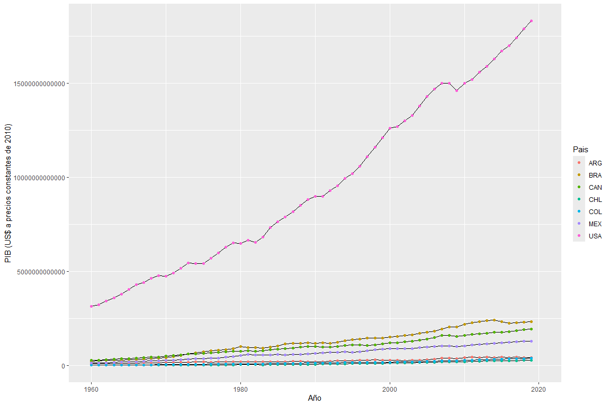
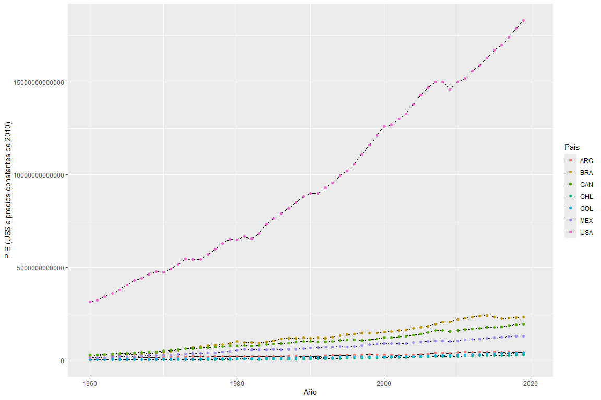

Datos ordenados
================

``` r
knitr::opts_chunk$set(fig.width=12, fig.height=8)
```

En este capítulo trabajaremos con datos ordenados, o tablas de datos.

Los datos ordenados, generalmente, se refieren a una tabla de datos que
tiene cierto formato para analizar la información. Es decir, filas y
columnas que especifican la información de individuos (u objetos) y
variables. Una misma tabla de datos puede presentarse de diversas
formas, pero no todas las formas o estructuras de tablas son eficientes
para generar visualizaciones o generar agregados estadísticos.

En general, será necesario manipular los datos para generar una tabla
estructurada u organizada a la que llamaremos tidy data.

El término tidy data se refiere a una forma específica de organizar los
valores de un conjunto de datos. Una tabla de datos del tipo tidy data
se organiza de la siguiente manera:

las filas representan individuos u observaciones, mientras que las
columnas representan variables y los valores referentes a cada
observación en cada variable se muestran en las celdas.

### TIDY DATA

Las tablas tipo “Tidy” deben cumplir 3 características:

1)Cada fila representa un individuo u observación

2)  Cada columna representa una variable

3)  Cada celda representa un valor

``` r
options(scipen = 999) #Esto es para desactivar la notación científica
```

``` r
library(tidyverse)
```

    ## Warning: package 'tidyverse' was built under R version 4.2.3

    ## Warning: package 'ggplot2' was built under R version 4.2.3

    ## Warning: package 'tibble' was built under R version 4.2.3

    ## Warning: package 'tidyr' was built under R version 4.2.3

    ## Warning: package 'readr' was built under R version 4.2.3

    ## Warning: package 'purrr' was built under R version 4.2.3

    ## Warning: package 'dplyr' was built under R version 4.2.3

    ## Warning: package 'stringr' was built under R version 4.2.3

    ## Warning: package 'forcats' was built under R version 4.2.3

    ## Warning: package 'lubridate' was built under R version 4.2.3

    ## ── Attaching core tidyverse packages ──────────────────────── tidyverse 2.0.0 ──
    ## ✔ dplyr     1.1.4     ✔ readr     2.1.5
    ## ✔ forcats   1.0.0     ✔ stringr   1.5.1
    ## ✔ ggplot2   3.5.0     ✔ tibble    3.2.1
    ## ✔ lubridate 1.9.3     ✔ tidyr     1.3.1
    ## ✔ purrr     1.0.2     
    ## ── Conflicts ────────────────────────────────────────── tidyverse_conflicts() ──
    ## ✖ dplyr::filter() masks stats::filter()
    ## ✖ dplyr::lag()    masks stats::lag()
    ## ℹ Use the conflicted package (<http://conflicted.r-lib.org/>) to force all conflicts to become errors

``` r
library(readxl)
```

    ## Warning: package 'readxl' was built under R version 4.2.3

``` r
tabla_1 <- read_excel("C:/Users/david/OneDrive/Escritorio/Personal/a2/Curso - R/6. Datos_ordenados/Datos_ordenados_datos/tablas_ejemplo.xls", sheet = "tabla1")
tabla_2 <- read_excel("C:/Users/david/OneDrive/Escritorio/Personal/a2/Curso - R/6. Datos_ordenados/Datos_ordenados_datos/tablas_ejemplo.xls", sheet = "tabla2")
tabla_3 <- read_excel("C:/Users/david/OneDrive/Escritorio/Personal/a2/Curso - R/6. Datos_ordenados/Datos_ordenados_datos/tablas_ejemplo.xls", sheet = "tabla3")

tabla_1
```

    ## # A tibble: 3 × 3
    ##   Nombre       `Tratamiento A` `Tratamiento B`
    ##   <chr>                  <dbl>           <dbl>
    ## 1 John Smith                NA               2
    ## 2 Jane Doe                  16              11
    ## 3 Mary Johnson               3               1

``` r
tabla_2
```

    ## # A tibble: 2 × 4
    ##   Tratamiento   `John Smith` `Jane Doe` `Mary Johnson`
    ##   <chr>                <dbl>      <dbl>          <dbl>
    ## 1 Tratamiento A           NA         16              3
    ## 2 Tratamiento B            2         11              1

``` r
tabla_3
```

    ## # A tibble: 6 × 3
    ##   Persona      Tratamiento Resultado
    ##   <chr>        <chr>           <dbl>
    ## 1 John Smith   A                  NA
    ## 2 Jane Doe     A                  16
    ## 3 Mary Johnson A                   3
    ## 4 John Smith   B                   2
    ## 5 Jane Doe     B                  11
    ## 6 Mary Johnson B                   1

La tabla 3 es la única que está correcta. No hay que agregar columnas
adicionales (lo que si pasa en la tabla 2 para los pacientes, o en la
tabla 1 para los tratamientos).

Así, ya tenemos la “tidy data” (o datos limpios), que es la tabla ya
limpia, y la cual se puede trabajar.

### GATHERING

Hay dos razones por las cuales una tabla puede estar desorganizada:

1)  Una variable en muchas columnas
2)  Una observación en muchas filas

En el primer caso se usa “gather”

``` r
datos <- read_csv("C:/Users/david/OneDrive/Escritorio/Personal/a2/Curso - R/6. Datos_ordenados/Datos_ordenados_datos/datos_banco_mundial.csv")
```

    ## Rows: 21 Columns: 65
    ## ── Column specification ────────────────────────────────────────────────────────
    ## Delimiter: ","
    ## chr (62): Pais nombre, Pais, serie Name, serie Code, 1960, 1961, 1962, 1963,...
    ## dbl  (3): 2007, 2008, 2009
    ## 
    ## ℹ Use `spec()` to retrieve the full column specification for this data.
    ## ℹ Specify the column types or set `show_col_types = FALSE` to quiet this message.

``` r
head(datos)
```

    ## # A tibble: 6 × 65
    ##   `Pais nombre` Pais  `serie Name`      `serie Code` `1960` `1961` `1962` `1963`
    ##   <chr>         <chr> <chr>             <chr>        <chr>  <chr>  <chr>  <chr> 
    ## 1 Argentina     ARG   PIB (US$ a preci… NY.GDP.MKTP… 1.16E… 1.22E… 1.21E… 1.14E…
    ## 2 Argentina     ARG   Poblacion, total  SP.POP.TOTL  20481… 20817… 21153… 21488…
    ## 3 Argentina     ARG   Cajeros automati… FB.ATM.TOTL… ..     ..     ..     ..    
    ## 4 Canadá        CAN   PIB (US$ a preci… NY.GDP.MKTP… 2.94E… 3.03E… 3.26E… 3.43E…
    ## 5 Canadá        CAN   Poblacion, total  SP.POP.TOTL  17909… 18271… 18614… 18964…
    ## 6 Canadá        CAN   Cajeros automati… FB.ATM.TOTL… ..     ..     ..     ..    
    ## # ℹ 57 more variables: `1964` <chr>, `1965` <chr>, `1966` <chr>, `1967` <chr>,
    ## #   `1968` <chr>, `1969` <chr>, `1970` <chr>, `1971` <chr>, `1972` <chr>,
    ## #   `1973` <chr>, `1974` <chr>, `1975` <chr>, `1976` <chr>, `1977` <chr>,
    ## #   `1978` <chr>, `1979` <chr>, `1980` <chr>, `1981` <chr>, `1982` <chr>,
    ## #   `1983` <chr>, `1984` <chr>, `1985` <chr>, `1986` <chr>, `1987` <chr>,
    ## #   `1988` <chr>, `1989` <chr>, `1990` <chr>, `1991` <chr>, `1992` <chr>,
    ## #   `1993` <chr>, `1994` <chr>, `1995` <chr>, `1996` <chr>, `1997` <chr>, …

Nos trae varias columnas, en las cuales están los años por separado.
Dice que son 65 variables pero son los años repetidos. Podemos armar una
columna que se llame “años”

``` r
library(dplyr)

datos2 <- datos%>%
  gather('1960' : '2020', key = "Año", value = "valor")

datos2
```

    ## # A tibble: 1,281 × 6
    ##    `Pais nombre` Pais  `serie Name`                     `serie Code` Año   valor
    ##    <chr>         <chr> <chr>                            <chr>        <chr> <chr>
    ##  1 Argentina     ARG   PIB (US$ a precios constantes d… NY.GDP.MKTP… 1960  1.16…
    ##  2 Argentina     ARG   Poblacion, total                 SP.POP.TOTL  1960  2048…
    ##  3 Argentina     ARG   Cajeros automaticos (por cada 1… FB.ATM.TOTL… 1960  ..   
    ##  4 Canadá        CAN   PIB (US$ a precios constantes d… NY.GDP.MKTP… 1960  2.94…
    ##  5 Canadá        CAN   Poblacion, total                 SP.POP.TOTL  1960  1790…
    ##  6 Canadá        CAN   Cajeros automaticos (por cada 1… FB.ATM.TOTL… 1960  ..   
    ##  7 Brasil        BRA   PIB (US$ a precios constantes d… NY.GDP.MKTP… 1960  2.47…
    ##  8 Brasil        BRA   Poblacion, total                 SP.POP.TOTL  1960  7217…
    ##  9 Brasil        BRA   Cajeros automaticos (por cada 1… FB.ATM.TOTL… 1960  ..   
    ## 10 Chile         CHL   PIB (US$ a precios constantes d… NY.GDP.MKTP… 1960  2937…
    ## # ℹ 1,271 more rows

Se utiliza una UNICA comilla (’), “:” me indica un rango de valores
entre los cuales trabajar. Da dos variables. “key” genera una primera
columna con los títulos de las columnas a resumir, y se especifica el
valor. “value” especifica el nombre lo que había en cada celda debajo de
cada año.

Ya tenemos una tabla con solo 6 columnas!!!

NOTA: En R no importa la cantidad de filas, pero si es ideal disminuir
la cantidad de columnas.

### SPREADING

Los datos anteriores aún no son “tidy data”, porque las variables de la
columna “Serie name” son repetitivas, se podrían tener en columnas
independientes, para hacer un registro más fácil.

Para eso se usa la función “spread”.

``` r
datos3 <- datos2%>%
  select(-('serie Code'))%>% #Porque esta columna queda inutil en esta organización, e impediria el nuevo arreglo
  spread(key="serie Name", value = "valor")

datos3
```

    ## # A tibble: 427 × 6
    ##    `Pais nombre` Pais  Año   Cajeros automaticos (por c…¹ PIB (US$ a precios c…²
    ##    <chr>         <chr> <chr> <chr>                        <chr>                 
    ##  1 Argentina     ARG   1960  ..                           1.16E+11              
    ##  2 Argentina     ARG   1961  ..                           1.22E+11              
    ##  3 Argentina     ARG   1962  ..                           1.21E+11              
    ##  4 Argentina     ARG   1963  ..                           1.14E+11              
    ##  5 Argentina     ARG   1964  ..                           1.26E+11              
    ##  6 Argentina     ARG   1965  ..                           1.39E+11              
    ##  7 Argentina     ARG   1966  ..                           1.38E+11              
    ##  8 Argentina     ARG   1967  ..                           1.43E+11              
    ##  9 Argentina     ARG   1968  ..                           1.50E+11              
    ## 10 Argentina     ARG   1969  ..                           1.64E+11              
    ## # ℹ 417 more rows
    ## # ℹ abbreviated names: ¹​`Cajeros automaticos (por cada 100.000 adultos)`,
    ## #   ²​`PIB (US$ a precios constantes de 2010)`
    ## # ℹ 1 more variable: `Poblacion, total` <chr>

Está distribuyendo la columna de “valor” entre las nuevas columnas que
son las de “serie Name”.

Ahora si, practicamente tenemos una “tidy data”, pero hay que cambiar el
tipo de variable.

### LIMPIAR Y CONVERTIR DATOS

Ahora tenemos que reemplzara los valores perdidos por “NA” y determinar
el tipo de variable.

``` r
datos <- datos3%>%
  mutate(`Cajeros automaticos (por cada 100.000 adultos)` = ifelse(`Cajeros automaticos (por cada 100.000 adultos)`=="..", NA, `Cajeros automaticos (por cada 100.000 adultos)`))%>%
  mutate(`PIB (US$ a precios constantes de 2010)`= ifelse(`PIB (US$ a precios constantes de 2010)`== "..", NA, `PIB (US$ a precios constantes de 2010)`))%>%
  mutate(`Poblacion, total` = ifelse(`Poblacion, total`=="..", NA, `Poblacion, total`))

datos3
```

    ## # A tibble: 427 × 6
    ##    `Pais nombre` Pais  Año   Cajeros automaticos (por c…¹ PIB (US$ a precios c…²
    ##    <chr>         <chr> <chr> <chr>                        <chr>                 
    ##  1 Argentina     ARG   1960  ..                           1.16E+11              
    ##  2 Argentina     ARG   1961  ..                           1.22E+11              
    ##  3 Argentina     ARG   1962  ..                           1.21E+11              
    ##  4 Argentina     ARG   1963  ..                           1.14E+11              
    ##  5 Argentina     ARG   1964  ..                           1.26E+11              
    ##  6 Argentina     ARG   1965  ..                           1.39E+11              
    ##  7 Argentina     ARG   1966  ..                           1.38E+11              
    ##  8 Argentina     ARG   1967  ..                           1.43E+11              
    ##  9 Argentina     ARG   1968  ..                           1.50E+11              
    ## 10 Argentina     ARG   1969  ..                           1.64E+11              
    ## # ℹ 417 more rows
    ## # ℹ abbreviated names: ¹​`Cajeros automaticos (por cada 100.000 adultos)`,
    ## #   ²​`PIB (US$ a precios constantes de 2010)`
    ## # ℹ 1 more variable: `Poblacion, total` <chr>

Usando “mutate” puedo hacer uchos cambios en una misma tabla con una
sola línea de código

``` r
summary(datos)
```

    ##  Pais nombre            Pais               Año           
    ##  Length:427         Length:427         Length:427        
    ##  Class :character   Class :character   Class :character  
    ##  Mode  :character   Mode  :character   Mode  :character  
    ##  Cajeros automaticos (por cada 100.000 adultos)
    ##  Length:427                                    
    ##  Class :character                              
    ##  Mode  :character                              
    ##  PIB (US$ a precios constantes de 2010) Poblacion, total  
    ##  Length:427                             Length:427        
    ##  Class :character                       Class :character  
    ##  Mode  :character                       Mode  :character

El año, Cajeros, PIB y población total no deberían ser caracteres. Se
puede cambiar con parse, pero hay otra forma

``` r
datos2 <- datos%>%
  mutate(Año = as.numeric(Año))%>%
  mutate(`Cajeros automaticos (por cada 100.000 adultos)`=as.numeric(`Cajeros automaticos (por cada 100.000 adultos)`))%>%
  mutate(`PIB (US$ a precios constantes de 2010)`=as.numeric(`PIB (US$ a precios constantes de 2010)`))%>%
  mutate(`Poblacion, total`=as.numeric(`Poblacion, total`))

datos2
```

    ## # A tibble: 427 × 6
    ##    `Pais nombre` Pais    Año Cajeros automaticos (por c…¹ PIB (US$ a precios c…²
    ##    <chr>         <chr> <dbl>                        <dbl>                  <dbl>
    ##  1 Argentina     ARG    1960                           NA           116000000000
    ##  2 Argentina     ARG    1961                           NA           122000000000
    ##  3 Argentina     ARG    1962                           NA           121000000000
    ##  4 Argentina     ARG    1963                           NA           114000000000
    ##  5 Argentina     ARG    1964                           NA           126000000000
    ##  6 Argentina     ARG    1965                           NA           139000000000
    ##  7 Argentina     ARG    1966                           NA           138000000000
    ##  8 Argentina     ARG    1967                           NA           143000000000
    ##  9 Argentina     ARG    1968                           NA           150000000000
    ## 10 Argentina     ARG    1969                           NA           164000000000
    ## # ℹ 417 more rows
    ## # ℹ abbreviated names: ¹​`Cajeros automaticos (por cada 100.000 adultos)`,
    ## #   ²​`PIB (US$ a precios constantes de 2010)`
    ## # ℹ 1 more variable: `Poblacion, total` <dbl>

``` r
summary(datos2)
```

    ##  Pais nombre            Pais                Año      
    ##  Length:427         Length:427         Min.   :1960  
    ##  Class :character   Class :character   1st Qu.:1975  
    ##  Mode  :character   Mode  :character   Median :1990  
    ##                                        Mean   :1990  
    ##                                        3rd Qu.:2005  
    ##                                        Max.   :2020  
    ##                                                      
    ##  Cajeros automaticos (por cada 100.000 adultos)
    ##  Min.   :  1.871                               
    ##  1st Qu.: 41.372                               
    ##  Median : 55.620                               
    ##  Mean   : 88.483                               
    ##  3rd Qu.:117.120                               
    ##  Max.   :228.429                               
    ##  NA's   :328                                   
    ##  PIB (US$ a precios constantes de 2010) Poblacion, total   
    ##  Min.   :   29375692257                 Min.   :  8132990  
    ##  1st Qu.:  193750000000                 1st Qu.: 24039927  
    ##  Median :  445000000000                 Median : 39657130  
    ##  Mean   : 1874444953650                 Mean   : 83935403  
    ##  3rd Qu.: 1287500000000                 3rd Qu.:120439848  
    ##  Max.   :18300000000000                 Max.   :328239523  
    ##  NA's   :7                              NA's   :7

Como ya es numérico me da el resumen estadístico.

NOTA: R no tolera espacios en los nombres de las tablas, por eso se usa
la comilla sencilla (\`) para poner el nombre.

Vamos a intentar hacer una gráfica del crecimiento del PIB por país

``` r
ggplot(data = datos2, aes(Año, `PIB (US$ a precios constantes de 2010)`))+
  geom_line(aes(group=Pais), na.rm = T)+
  geom_point(aes(color = Pais), na.rm = T)
```

<!-- -->

MI INTENTO…

``` r
datos3 <- datos2%>%
  group_by(Pais, Año)

ggplot(data = datos3)+
  geom_line(mapping = aes(x = Año, y = `PIB (US$ a precios constantes de 2010)`, linetype = Pais), na.rm=T)+
  geom_point(mapping = aes(x=Año, y = `PIB (US$ a precios constantes de 2010)`, color = Pais),na.rm = T)
```

<!-- -->

Se puede agrupar directamente desde el ggplot, y no hay que crear una
nueva tabla con los agrupamientos!!!

### UNIR Y SEPARAR

Como separar o unir datos dentro de columnas

``` r
datos <- read_csv("C:/Users/david/OneDrive/Escritorio/Personal/a2/Curso - R/6. Datos_ordenados/Datos_ordenados_datos/Investigadores-SNI-Vigentes-2018.csv")
```

    ## Rows: 28578 Columns: 7
    ## ── Column specification ────────────────────────────────────────────────────────
    ## Delimiter: ","
    ## chr (7): Grado, Apellido Paterno, Apellido Materno, Nombre, Nivel, Instituci...
    ## 
    ## ℹ Use `spec()` to retrieve the full column specification for this data.
    ## ℹ Specify the column types or set `show_col_types = FALSE` to quiet this message.

``` r
datos
```

    ## # A tibble: 28,578 × 7
    ##    Grado    `Apellido Paterno` `Apellido Materno` Nombre           Nivel
    ##    <chr>    <chr>              <chr>              <chr>            <chr>
    ##  1 DRA.     HERNANDEZ          LOPEZ              SILVIA HORTENCIA C    
    ##  2 DR.      FINKELSTEIN        SHAPIRO            DANIEL           1    
    ##  3 DR.      ALEJO              JAIME              ANTONIO          1    
    ##  4 MED.     GIL                CARRASCO           FELIX            1    
    ##  5 M. EN C. RUIZ               CRUZ               MATILDE          1    
    ##  6 MED.     JIMENEZ            ROMAN              JESUS            1    
    ##  7 DR.      HERNANDEZ          ZIMBRON            LUIS FERNANDO    1    
    ##  8 DR.      FROMOW             GUERRA             JORGE JANS       1    
    ##  9 MED.     QUIROZ             MERCADO            HUGO             3    
    ## 10 DR.      BENAVIDES          PERALES            GUILLERMO        2    
    ## # ℹ 28,568 more rows
    ## # ℹ 2 more variables: `Institucion de Adscripcion` <chr>,
    ## #   `Area del Conocimiento` <chr>

Quiero unir los nombres para tener el nombre completo, y quiero separar
en dos columnas la columna de área del conocimiento.

Para unir, se utiliza la función “unite”

``` r
datos <- datos%>%
  unite(Nombre, `Apellido Paterno`, `Apellido Materno`, Nombre, sep = " ")

datos  
```

    ## # A tibble: 28,578 × 5
    ##    Grado    Nombre           Nivel Institucion de Adscr…¹ Area del Conocimient…²
    ##    <chr>    <chr>            <chr> <chr>                  <chr>                 
    ##  1 DRA.     HERNANDEZ LOPEZ… C     AGROPECUARIA EL AVION… Área VI: BIOTECNOLOGÍ…
    ##  2 DR.      FINKELSTEIN SHA… 1     ARIZONA STATE UNIVERS… Área II: BIOLOGÍA Y Q…
    ##  3 DR.      ALEJO JAIME ANT… 1     ASOCIACION MEXICANA D… Área V: CIENCIAS SOCI…
    ##  4 MED.     GIL CARRASCO FE… 1     ASOCIACION PARA EVITA… Área III: MEDICINA Y …
    ##  5 M. EN C. RUIZ CRUZ MATIL… 1     ASOCIACION PARA EVITA… Área III: MEDICINA Y …
    ##  6 MED.     JIMENEZ ROMAN J… 1     ASOCIACION PARA EVITA… Área III: MEDICINA Y …
    ##  7 DR.      HERNANDEZ ZIMBR… 1     ASOCIACION PARA EVITA… Área III: MEDICINA Y …
    ##  8 DR.      FROMOW GUERRA J… 1     ASOCIACION PARA EVITA… Área III: MEDICINA Y …
    ##  9 MED.     QUIROZ MERCADO … 3     ASOCIACION PARA EVITA… Área III: MEDICINA Y …
    ## 10 DR.      BENAVIDES PERAL… 2     BANCO DE MEXICO        Área V: CIENCIAS SOCI…
    ## # ℹ 28,568 more rows
    ## # ℹ abbreviated names: ¹​`Institucion de Adscripcion`, ²​`Area del Conocimiento`

No quedan las columnas que se unieron, ellas se eliminan. ” ” me separa
los nombres con un espacio, si no, quedarían pegados

``` r
datos <- datos%>%
  separate(`Area del Conocimiento`, into = c("cve_area", "area"), sep = ":")

datos
```

    ## # A tibble: 28,578 × 6
    ##    Grado    Nombre                   Nivel Institucion de Adscr…¹ cve_area area 
    ##    <chr>    <chr>                    <chr> <chr>                  <chr>    <chr>
    ##  1 DRA.     HERNANDEZ LOPEZ SILVIA … C     AGROPECUARIA EL AVION… Área VI  " BI…
    ##  2 DR.      FINKELSTEIN SHAPIRO DAN… 1     ARIZONA STATE UNIVERS… Área II  " BI…
    ##  3 DR.      ALEJO JAIME ANTONIO      1     ASOCIACION MEXICANA D… Área V   " CI…
    ##  4 MED.     GIL CARRASCO FELIX       1     ASOCIACION PARA EVITA… Área III " ME…
    ##  5 M. EN C. RUIZ CRUZ MATILDE        1     ASOCIACION PARA EVITA… Área III " ME…
    ##  6 MED.     JIMENEZ ROMAN JESUS      1     ASOCIACION PARA EVITA… Área III " ME…
    ##  7 DR.      HERNANDEZ ZIMBRON LUIS … 1     ASOCIACION PARA EVITA… Área III " ME…
    ##  8 DR.      FROMOW GUERRA JORGE JANS 1     ASOCIACION PARA EVITA… Área III " ME…
    ##  9 MED.     QUIROZ MERCADO HUGO      3     ASOCIACION PARA EVITA… Área III " ME…
    ## 10 DR.      BENAVIDES PERALES GUILL… 2     BANCO DE MEXICO        Área V   " CI…
    ## # ℹ 28,568 more rows
    ## # ℹ abbreviated name: ¹​`Institucion de Adscripcion`
